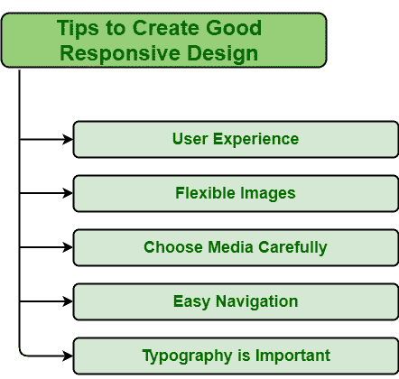

# 如何打造好的响应性设计？

> 原文:[https://www . geesforgeks . org/how-to-create-good-responsive-design/](https://www.geeksforgeeks.org/how-to-create-good-responsive-design/)

首先，一个人应该知道响应性设计的确切含义。简而言之，响应设计是一种简单地允许网站设计和代码根据设备屏幕的大小进行自我调整或响应的方式。响应式设计的主要目标是提高所有类型设备(如台式机、笔记本电脑、手机、平板电脑等)的正面用户体验。在当今世界，如果一个人想增加他们的业务增长，并领先于其他竞争对手，那么他们应该去响应网页设计。网站不仅要在台式机或笔记本电脑屏幕上好看，在手机或平板电脑上也要好看。这是吸引更多观众或用户使用你的产品的最好方法。当今一代人主要通过移动设备浏览网站，因此让网站具有响应性非常重要。

### 创建良好响应设计的技巧

现在，每个人都知道响应性设计意味着什么，以及为什么它对业务很重要。一个人应该知道如何创建或建立一个响应性的网站。下面给出了一些提示，将帮助您创建良好的响应设计:

**1。用户体验**

用户体验非常重要，因为它只是试图满足用户需求。良好的用户体验通常对任何业务都有很大帮助，并能保持用户对产品或品牌的忠诚。用户体验将决定客户将在您的网站上停留多长时间，以及它与业务成功的关系。因此，在设计一个响应性网站时，人们应该记住用户体验、他们的交互、他们在您的网站上寻找什么内容、他们用来查看网站的设备类型等。对于经常访问网站的用户来说，响应迅速的网站是增加和改善用户体验的最佳方式。

例如，《连线》就是一个很好的例子，它是一个反应灵敏的网站，可以确保用户快速获得他们想要的信息和文章。

**2。灵活的图像**

柔性图像也称为自适应图像。灵活的图像对于一个好的响应设计非常重要。灵活的图像允许用户提供没有任何限制的图像解决方案，以适应观看图像的屏幕尺寸。在设计一个网站时，人们应该记住手机屏幕以及网站在手机屏幕上的外观。主要元素是图像和内容。人们需要检查图像是否看起来很棒。使用 CSS，人们可以处理图像在不同设备屏幕上的外观。使用%单位而不是像素最适合屏幕。

例如，Dropbox 是一个响应性网站的好例子，它包含灵活的图像，并提高了跨设备的用户体验。

**3。谨慎选择媒体**

一个响应良好的网站还包括页面速度和性能，即用户访问网站时页面内容加载的速度。如果网站速度和性能差，那么就会增加失去用户或客户的几率。网页速度和性能一般受到各种因素的影响。媒体文件是影响响应网站速度和性能的最重要因素之一。有时，高分辨率图像和视频包含在覆盖更多磁盘空间的网页中，最终会减慢页面加载时间并降低性能。因此，提高页面加载速度的最佳方法是压缩媒体文件大小。通过减小尺寸，可以减轻它们的重量，从而提高加载页面的速度。尽管视觉效果对吸引顾客很重要，但质量和速度之间应该有一个平衡。

比如大脚野人！音乐节、纽约市战役等。是一个响应迅速的网站的好例子，包括视频、动态效果、奇妙的图形等。

**4。轻松导航**

网站导航非常重要，因为它不仅能告诉我们包含哪些内容，还能告诉我们在哪里可以找到信息。人们大多通过移动设备访问网站。如果网站导航不好，设计差，那么用户可能会决定不继续访问和探索一个网站。因此，在设计一个反应灵敏的网站时，要确保即使在小尺寸屏幕上也能轻松浏览。

比如英国心脏基金会、纽约市战役等。是一个响应性网站的好例子，包括有效的移动导航，并使整个层更整齐。

**5。排版很重要**

排版非常重要，是将文本作为视觉层次并在设计中调整文本的最佳方式。它只是为网站提供图形平衡，通过为品牌创造视觉效果来传达品牌信息，在展示过程中起着非常重要的作用。因此，在设计一个有响应的网站时，应该注意排版。它包括字体类型、字号、颜色对比、内容、线长等。

例如，纸老虎是一个响应性网站的好例子，它包括有效的排版，并展示了排版的使用，优化了空间的使用，以及大胆的视觉效果和动态动画。