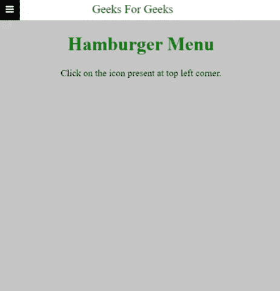
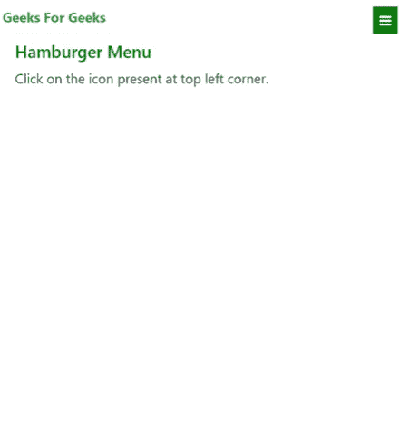

# 如何为移动设备创建汉堡菜单？

> 原文:[https://www . geesforgeks . org/如何为移动设备创建汉堡菜单/](https://www.geeksforgeeks.org/how-to-create-hamburger-menu-for-mobile-devices/)

汉堡按钮是放置在网页用户界面右上角的按钮。汉堡包按钮切换屏幕上的导航菜单栏。与此小部件相关联的图标由三个水平条组成，也称为折叠菜单图标。

**我们将创建:**

*   汉堡菜单使用 html，CSS 和 JavaScript 为移动设备
*   使用引导程序的汉堡菜单

**移动设备使用 html、CSS 和 JavaScript 的汉堡菜单:**我们将编写自己的所有 HTML 和 CSS，并添加一些 JavaScript 来处理点击事件。基本方法是将导航栏的可见性标记为隐藏。当用户点击图标时，JavaScript 会将可见性从隐藏中移除。

## 超文本标记语言

```htmlhtml
<!DOCTYPE html>
<html lang="en">

<head>
    <meta charset="UTF-8">
    <meta name="viewport" content=
"width=device-width, initial-scale=1.0">

    <link rel="stylesheet" href=
"https://cdnjs.cloudflare.com/ajax/libs/font
    -awesome/4.7.0/css/font-awesome.min.css">

    <title>GFG Hamburger Menu Tutorial</title>

    <style>
        .container {
            max-width: 480px;
            height: 500px;
            background: #5555;
            margin: auto;
            border: 2px solid green;
        }

        .navbar {
            background: white;
            position: relative;
        }

        .links {
            display: none;
        }

        .heading a:nth-child(2) {
            color: green;
            text-decoration: none;
            font-size: 20px;
            display: block;
            padding: 7px;
            margin-left: 150px;
        }

        .heading a i {
            color: green;
            padding: 10px;
            display: block;
            position: absolute;
            left: 0;
            top: 0;
        }

        .heading a i:hover {
            background-color: rgb(0, 0, 0);
            color: rgb(255, 255, 255);
        }

        .links {
            background-color: rgb(190, 196, 190);
        }

        .links a {
            color: green;
            padding: 5px 16px;
            text-decoration: none;
            font-size: 17px;
            display: block;
            text-align: center;
            border-bottom: 1px solid white;
        }

        .links a:hover {
            background-color: green;
            color: white;
        }
    </style>
</head>

<body>
    <div class="container">
        <div class="navbar">
            <div class="heading">
                <a href="#hamburger-icon" onclick="gfgMenu()">
                    <i class="fa fa-bars"></i>
                </a>
                <a href="#Home"> Geeks For Geeks </a>
            </div>
            <div class="links">
                <a href="#gfg1"> Notes </a>
                <a href="#gfg2"> Algorithm </a>
                <a href="#gfg3"> Maths </a>
                <a href="#gfg4"> Data Structure </a>
                <a href="#gfg5"> Java </a>
            </div>
        </div>
    </div>

    <script>
        function gfgMenu() {
            const GFG = document.querySelector('.links');

            if (GFG.style.display === "none") {
                GFG.style.display = "block";
            }
            else {
                GFG.style.display = "none";
            }
        }
    </script>
</body>

</html>
```

**输出:**



**使用 bootstrap 的汉堡菜单:**在这种方法中，我们将使用 Bootstrap 来设计我们的页面，JavaScript 的工作与上述方法相同。

## 超文本标记语言

```htmlhtml
<!DOCTYPE html>
<html lang="en">

<head>
    <meta charset="UTF-8">
    <meta name="viewport" content=
"width=device-width, initial-scale=1.0">
    <link rel="stylesheet" href=
"https://cdnjs.cloudflare.com/ajax/libs/font-awesome/4.7.0/css/font-awesome.min.css">

    <link rel="stylesheet" href=
"https://cdn.jsdelivr.net/npm/bootstrap@4.5.3/dist/css/bootstrap.min.css"
        integrity=
"sha384-TX8t27EcRE3e/ihU7zmQxVncDAy5uIKz4rEkgIXeMed4M0jlfIDPvg6uqKI2xXr2"
        crossorigin="anonymous">

    <title>GFG Hamburger Menu</title>

    <style>
        .icon,
        h5 {
            color: green;
        }

        .links a:hover,
        .icon:hover {
            background-color: green;
            color: white;
            transition: 0.4s all linear;
        }
    </style>
</head>

<body>
    <div class="container">
        <div class="pt-2 pb-2 border-bottom">
            <a class="icon pl-2 pr-2 p-1  
                float-right" href="#hamburger-icon" 
                onclick="gfgMenu()">

                <i class="fa fa-bars"></i>
            </a>
            <a class="pt-2 pb-2 text-success 
                text-decoration-none font-weight
                        -bold" href="#Home"> 
                Geeks For Geeks
            </a>
        </div>
        <div class="links nav flex-column d-none">
            <a class="nav-link border-bottom" 
                href="#gfg1"> Notes </a>

            <a class="nav-link border-bottom" 
                href="#gfg2"> Algorithm </a>

            <a class="nav-link border-bottom" 
                href="#gfg3"> Maths </a>

            <a class="nav-link border-bottom" 
                href="#gfg4"> Data Structure </a>

            <a class="nav-link border-bottom" 
                href="#gfg5"> Java </a>
        </div>

        <div class="container">
            <h5 class="my-2">Hamburger Menu</h5>

<p>
                Click on the icon present 
                at top left corner.
            </p>

        </div>
    </div>

    <script>
        function gfgMenu() {
            const GFG = document.querySelector('.links');
            if (GFG.classList.contains('d-none')) {
                GFG.classList.remove('d-none');
            }
            else {
                GFG.classList.add('d-none');
            }
        }
    </script>
</body>

</html>
```

**输出:**

