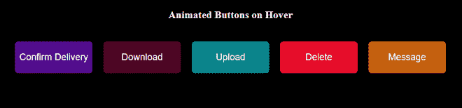
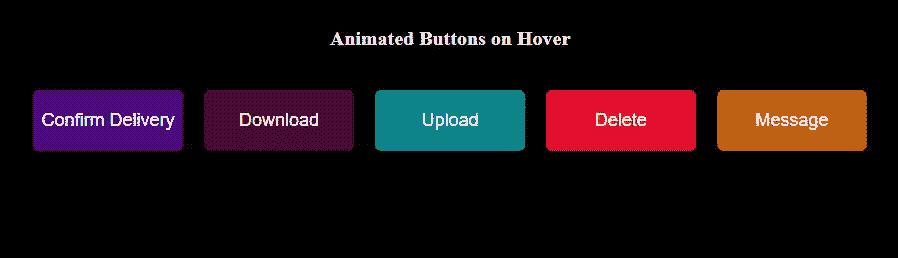

# 如何在按钮上创建悬停动画？

> 原文:[https://www . geeksforgeeks . org/如何创建悬停动画按钮/](https://www.geeksforgeeks.org/how-to-create-hover-animations-on-button/)

在这个项目中，我们将使用 HTML 和 CSS 创建动画按钮。当我们将鼠标悬停在这些按钮上时，它们上会显示一个表情符号，以显示更好的 UX。

**按钮一瞥:**



**CDN 链接:**对于按钮图标，我们将使用 fontawesome CDN 链接。将此链接放在脚本标签中。

> https://kit.fontawesome.com/704ff50790.js

**HTML:** 创建一个 HTML 文件，然后创建将是悬停效果的所有按钮的结构(切换到图标)。在容器内创建一个 div 容器，放置所有按钮。

## 超文本标记语言

```htmlhtml
<!DOCTYPE html>
<html lang="en">
  <head>
    <meta charset="UTF-8" />
    <meta name="viewport" 
          content="width=device-width, initial-scale=1.0" />
  </head>
  <body>
    <div class="container">
      <div class="button-effect">
        <h2>Animated Buttons on Hover</h2>
        <a class="effect effect-4" href="#" 
           title="Confirm Delivery">
            Confirm Delivery
        </a>
        <a class="effect effect-3" href="#" 
           title="Download">Download</a>
        <a class="effect effect-2" href="#" 
           title="Upload">Upload</a>
        <a class="effect effect-1" href="#"
           title="Delete">Delete</a>
        <a class="effect effect-5" href="#"
           title="Click Here to Message">
            Message
        </a>
      </div>
    </div>
    <script src=
"https://kit.fontawesome.com/704ff50790.js"
            crossorigin="anonymous">
    </script>
  </body>
</html>
```

**CSS:** 用来给我们的 HTML 页面赋予不同类型的动画和效果，让所有用户看起来都是交互式的。

*   恢复所有浏览器效果。
*   使用类和 id 给 HTML 元素赋予效果。
*   使用*@关键帧{}* 将动画赋予 HTML 元素。
*   使用 CSS 的第 n 个子选择器特性来调用不同的链接。

## 半铸钢ˌ钢性铸铁(Cast Semi-Steel)

```htmlhtml
<style>
      body {
        background-color: black;
      }
      body .container {
        width: 850px;
        margin: 70px auto 0px auto;
        text-align: center;
      }
      body .container .button-effect {
        padding: 30px 0px;
      }
      body .container .button-effect h2 {
        font-family: "Droid Serif", serif;
        font-size: 20px;
        color: #fff;
        margin-bottom: 40px;
      }
      body .container .button-effect a {
        margin-right: 17px;
      }
      body .container .button-effect a:nth-child(2) {
        background-color: #520a8d;
      }
      body .container .button-effect a:nth-child(3) {
        background-color: #4d0325;
      }
      body .container .button-effect a:nth-child(4) {
        background-color: #09858a;
      }
      body .container .button-effect a:nth-child(5) {
        background-color: #e60d2a;
      }
      body .container .button-effect a:nth-child(6) {
        background-color: #c45f0d;
      }
      body .container .button-effect a:last-child {
        margin-right: 0px;
      }

      .effect {
        text-align: center;
        display: inline-block;
        position: relative;
        text-decoration: none;
        color: #fff;
        text-transform: capitalize;
        /* background-color: - add your own background-color */
        font-family: "Roboto", sans-serif;
        /* put your font-family */
        font-size: 18px;
        padding: 20px 0px;
        width: 150px;
        border-radius: 6px;
        overflow: hidden;
      }

      /* effect-4 styles */
      .effect.effect-4 {
        transition: all 0.2s linear 0s;
      }
      .effect.effect-4:before {
        content: "\f0d1";
        font-family: FontAwesome;
        display: flex;
        align-items: center;
        justify-content: center;
        position: absolute;
        top: 0;
        left: 0px;
        width: 100%;
        height: 100%;
        text-align: center;
        font-size: 30px;
        transform: scale(0, 1);
        transition: all 0.2s linear 0s;
      }
      .effect.effect-4:hover {
        text-indent: -9999px;
      }
      .effect.effect-4:hover:before {
        transform: scale(1, 1);
        text-indent: 0;
      }

      .effect.effect-3 {
        transition: all 0.2s linear 0s;
      }
      .effect.effect-3:before {
        content: "\f019";
        font-family: FontAwesome;
        display: flex;
        align-items: center;
        justify-content: center;
        position: absolute;
        top: 0;
        left: 0px;
        width: 100%;
        height: 100%;
        text-align: center;
        font-size: 30px;
        transform: scale(0, 1);
        transition: all 0.2s linear 0s;
      }
      .effect.effect-3:hover {
        text-indent: -9999px;
      }
      .effect.effect-3:hover:before {
        transform: scale(1, 1);
        text-indent: 0;
      }

      .effect.effect-2 {
        transition: all 0.2s linear 0s;
      }
      .effect.effect-2:before {
        content: "\f093";
        font-family: FontAwesome;
        display: flex;
        align-items: center;
        justify-content: center;
        position: absolute;
        top: 0;
        left: 0px;
        width: 100%;
        height: 100%;
        text-align: center;
        font-size: 30px;
        transform: scale(0, 1);
        transition: all 0.2s linear 0s;
      }
      .effect.effect-2:hover {
        text-indent: -9999px;
      }
      .effect.effect-2:hover:before {
        transform: scale(1, 1);
        text-indent: 0;
      }

      .effect.effect-1 {
        transition: all 0.2s linear 0s;
      }
      .effect.effect-1:before {
        content: "\f2ed";
        font-family: FontAwesome;
        display: flex;
        align-items: center;
        justify-content: center;
        position: absolute;
        top: 0;
        left: 0px;
        width: 100%;
        height: 100%;
        text-align: center;
        font-size: 30px;
        transform: scale(0, 1);
        transition: all 0.2s linear 0s;
      }
      .effect.effect-1:hover {
        text-indent: -9999px;
      }
      .effect.effect-1:hover:before {
        transform: scale(1, 1);
        text-indent: 0;
      }

      .effect.effect-5 {
        transition: all 0.2s linear 0s;
      }
      .effect.effect-5:before {
        content: "\f1d8";
        font-family: FontAwesome;
        display: flex;
        align-items: center;
        justify-content: center;
        position: absolute;
        top: 0;
        left: 0px;
        width: 100%;
        height: 100%;
        text-align: center;
        font-size: 30px;
        transform: scale(0, 1);
        transition: all 0.2s linear 0s;
      }
      .effect.effect-5:hover {
        text-indent: -9999px;
      }
      .effect.effect-5:hover:before {
        transform: scale(1, 1);
        text-indent: 0;
      }
    </style>
```

**完整解决方案:**在本节中，我们将把上述部分放在一起，创建吸引人的悬停动画按钮。

## 超文本标记语言

```htmlhtml
<!DOCTYPE html>
<html lang="en">
  <head>
    <meta charset="UTF-8" />
    <meta name="viewport" 
          content="width=device-width, initial-scale=1.0" />
    <style>
      body {
        background-color: black;
      }
      body .container {
        width: 850px;
        margin: 70px auto 0px auto;
        text-align: center;
      }
      body .container .button-effect {
        padding: 30px 0px;
      }
      body .container .button-effect h2 {
        font-family: "Droid Serif", serif;
        font-size: 20px;
        color: #fff;
        margin-bottom: 40px;
      }
      body .container .button-effect a {
        margin-right: 17px;
      }
      body .container .button-effect a:nth-child(2) {
        background-color: #520a8d;
      }
      body .container .button-effect a:nth-child(3) {
        background-color: #4d0325;
      }
      body .container .button-effect a:nth-child(4) {
        background-color: #09858a;
      }
      body .container .button-effect a:nth-child(5) {
        background-color: #e60d2a;
      }
      body .container .button-effect a:nth-child(6) {
        background-color: #c45f0d;
      }
      body .container .button-effect a:last-child {
        margin-right: 0px;
      }

      .effect {
        text-align: center;
        display: inline-block;
        position: relative;
        text-decoration: none;
        color: #fff;
        text-transform: capitalize;
        /* background-color: - add your own background-color */
        font-family: "Roboto", sans-serif;
        /* put your font-family */
        font-size: 18px;
        padding: 20px 0px;
        width: 150px;
        border-radius: 6px;
        overflow: hidden;
      }

      /* effect-4 styles */
      .effect.effect-4 {
        transition: all 0.2s linear 0s;
      }
      .effect.effect-4:before {
        content: "\f0d1";
        font-family: FontAwesome;
        display: flex;
        align-items: center;
        justify-content: center;
        position: absolute;
        top: 0;
        left: 0px;
        width: 100%;
        height: 100%;
        text-align: center;
        font-size: 30px;
        transform: scale(0, 1);
        transition: all 0.2s linear 0s;
      }
      .effect.effect-4:hover {
        text-indent: -9999px;
      }
      .effect.effect-4:hover:before {
        transform: scale(1, 1);
        text-indent: 0;
      }

      .effect.effect-3 {
        transition: all 0.2s linear 0s;
      }
      .effect.effect-3:before {
        content: "\f019";
        font-family: FontAwesome;
        display: flex;
        align-items: center;
        justify-content: center;
        position: absolute;
        top: 0;
        left: 0px;
        width: 100%;
        height: 100%;
        text-align: center;
        font-size: 30px;
        transform: scale(0, 1);
        transition: all 0.2s linear 0s;
      }
      .effect.effect-3:hover {
        text-indent: -9999px;
      }
      .effect.effect-3:hover:before {
        transform: scale(1, 1);
        text-indent: 0;
      }

      .effect.effect-2 {
        transition: all 0.2s linear 0s;
      }
      .effect.effect-2:before {
        content: "\f093";
        font-family: FontAwesome;
        display: flex;
        align-items: center;
        justify-content: center;
        position: absolute;
        top: 0;
        left: 0px;
        width: 100%;
        height: 100%;
        text-align: center;
        font-size: 30px;
        transform: scale(0, 1);
        transition: all 0.2s linear 0s;
      }
      .effect.effect-2:hover {
        text-indent: -9999px;
      }
      .effect.effect-2:hover:before {
        transform: scale(1, 1);
        text-indent: 0;
      }

      .effect.effect-1 {
        transition: all 0.2s linear 0s;
      }
      .effect.effect-1:before {
        content: "\f2ed";
        font-family: FontAwesome;
        display: flex;
        align-items: center;
        justify-content: center;
        position: absolute;
        top: 0;
        left: 0px;
        width: 100%;
        height: 100%;
        text-align: center;
        font-size: 30px;
        transform: scale(0, 1);
        transition: all 0.2s linear 0s;
      }
      .effect.effect-1:hover {
        text-indent: -9999px;
      }
      .effect.effect-1:hover:before {
        transform: scale(1, 1);
        text-indent: 0;
      }

      .effect.effect-5 {
        transition: all 0.2s linear 0s;
      }
      .effect.effect-5:before {
        content: "\f1d8";
        font-family: FontAwesome;
        display: flex;
        align-items: center;
        justify-content: center;
        position: absolute;
        top: 0;
        left: 0px;
        width: 100%;
        height: 100%;
        text-align: center;
        font-size: 30px;
        transform: scale(0, 1);
        transition: all 0.2s linear 0s;
      }
      .effect.effect-5:hover {
        text-indent: -9999px;
      }
      .effect.effect-5:hover:before {
        transform: scale(1, 1);
        text-indent: 0;
      }
    </style>
  </head>
  <body>
    <div class="container">
      <div class="button-effect">
        <h2>Animated Buttons on Hover</h2>
        <a class="effect effect-4" href="#" 
           title="Confirm Delivery">
            Confirm Delivery
        </a>
        <a class="effect effect-3" href="#" 
           title="Download">Download</a>
        <a class="effect effect-2" href="#" 
           title="Upload">Upload</a>
        <a class="effect effect-1" href="#"
           title="Delete">Delete</a>
        <a class="effect effect-5" href="#"
           title="Click Here to Message">
            Message
        </a>
      </div>
    </div>
    <script src=
"https://kit.fontawesome.com/704ff50790.js"
            crossorigin="anonymous"></script>
  </body>
</html>
```

**输出:**

