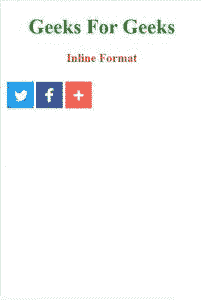

# 如何在谷歌 amp 中创建 Inline amp-addthis？

> 原文:[https://www . geesforgeks . org/how-create-inline-amp-addthis-in-Google-amp/](https://www.geeksforgeeks.org/how-to-create-inline-amp-addthis-in-google-amp/)


**简介:**有时候作为一个网络开发者，我们想要分享我们的社交媒体链接，为此，我们必须展示社交媒体按钮和 amp-adds，这完全是为了这个目的。amp-addthis 组件集成了 addthis 浮动栏和内嵌共享按钮。

**设置:**您必须在标题中导入 amp-addthis 组件才能使用该标签。

```html
<script async custom-element="amp-addthis" src=
"https://cdn.ampproject.org/v0/amp-addthis-0.1.js">
</script>
```

去这个网站[**【https://www.addthis.com/register】**](https://www.addthis.com/register)然后创建你的定制小工具，绝对免费。填写完详细信息并创建自定义小部件后，您将被引导到包含代码的页面。复制并粘贴到您的程序代码中。

**属性:**

1.  **data-pub-id:** 是正在使用的小部件的发布者的发布者 id。
2.  **数据-widget-id:** 是正在使用的 widget 的 widget ID。
3.  **数据-widget-type:** 这个属性描述了 widget 的类型，从浮动到内联。
4.  **数据-标题:**为可选属性，设置工具标题。如果不存在，则将采用文档中存在的那个。
5.  **数据-url:** 为可选属性，用于设置要共享的 url。如果不存在，则将采用文档中存在的那个。
6.  **数据媒体:**定义共享媒体的网址是可选属性。如果它不存在，那么它是未定义的。
7.  **数据-描述:**可选属性，用于设置页面的描述。如果它不存在，那么它是未定义的。

**示例:**

```html
<!DOCTYPE html>
<html amp>

<head>
    <meta charset="utf-8" />
    <script async 
        src="https://cdn.ampproject.org/v0.js">
    </script>

    <script async custom-element="amp-accordion"
src="https://cdn.ampproject.org/v0/amp-accordion-0.1.js">
    </script>

    <link rel="canonical" href=
"https://amp.dev/documentation/examples/components/amp-addthis/index.html"/>

    <meta name="viewport" content="width=device-width, 
            minimum-scale=1, initial-scale=1" />

    <title>GeeksForGeeks | amp-addthis</title>

    <style amp-boilerplate>
        body {
            -webkit-animation: -amp-start 8s 
                steps(1, end) 0s 1 normal both;

            -moz-animation: -amp-start 8s 
                steps(1, end) 0s 1 normal both;

            -ms-animation: -amp-start 8s 
                steps(1, end) 0s 1 normal both;

            animation: -amp-start 8s 
                steps(1, end) 0s 1 normal both;
        }

        @-webkit-keyframes -amp-start {
            from {
                visibility: hidden;
            }

            to {
                visibility: visible;
            }
        }

        @-moz-keyframes -amp-start {
            from {
                visibility: hidden;
            }

            to {
                visibility: visible;
            }
        }

        @-ms-keyframes -amp-start {
            from {
                visibility: hidden;
            }

            to {
                visibility: visible;
            }
        }

        @-o-keyframes -amp-start {
            from {
                visibility: hidden;
            }

            to {
                visibility: visible;
            }
        }

        @keyframes -amp-start {
            from {
                visibility: hidden;
            }

            to {
                visibility: visible;
            }
        }
    </style>

    <noscript>
        <style amp-boilerplate>
            body {
                -webkit-animation: none;
                -moz-animation: none;
                -ms-animation: none;
                animation: none;
            }
        </style>
    </noscript>

    <!-- Import the `amp-addthis` component. 
      It is mandatory script -->
    <script async custom-element="amp-addthis"
src="https://cdn.ampproject.org/v0/amp-addthis-0.1.js">
    </script>

    <style amp-custom>
        h1 {
            color: forestgreen;
        }

        h3 {
            color: crimson;
        }
    </style>
</head>

<body>
    <center>
        <h1>Geeks For Geeks</h1>

        <h3>Inline Formate</h3>
    </center>

    <!-- Integrate share buttons into your 
        content for a seamless sharing 
        experience. The code below should
        be replaced with your code -->
    <amp-addthis width="320" height="92" 
        data-pub-id="ra-5c191331410932ff" 
        data-widget-id="mv93"
        data-widget-type="inline">
    </amp-addthis>
</body>

</html>
```

**输出:**
