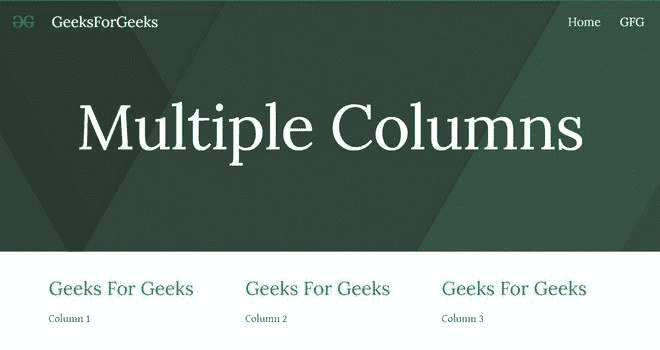
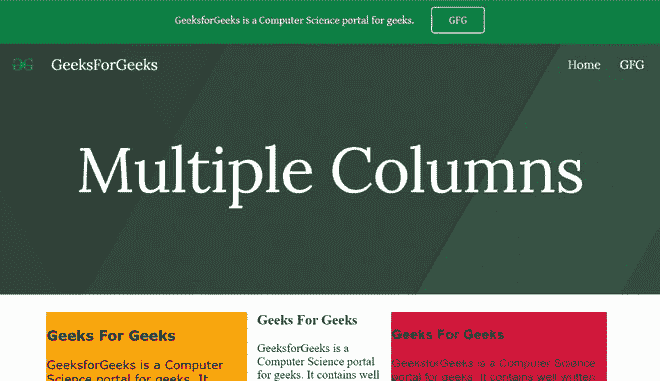

# 如何在新谷歌网站中创建多栏视图？

> 原文:[https://www . geesforgeks . org/how-create-multi-column-view-in-new-Google-sites/](https://www.geeksforgeeks.org/how-to-create-multi-column-view-in-new-google-sites/)


很多时候我们必须以列的形式显示一些内容。有两种方法可以在谷歌网站上实现:

*   使用内置自动网格对齐三个字段
*   使用嵌入添加三个部分

**方法 1:** 在该方法中，只需通过调整大小来调整文本框，以形成一个列视图，添加内容后，它将看起来像:



但是这里还不能添加 CSS 属性！！对于下面的方法 2 是完美的。

**方法二:**在你的 Google 站点网站中添加多栏视图，从插入面板中选择**嵌入**选项，然后转到出现对话框的**嵌入代码**部分。


在提供的空白处写下你的代码。要添加多列视图，请使用以下代码:

## 超文本标记语言

```
<html>

<head>
    <title>Three Column CSS Layout</title>
    <style type="text/css">
        body {
            margin-top: 0;
            margin-bottom: 0;
            margin-left: 0;
            margin-right: 0;
            padding-left: 1;
            padding-right: 0;
        }

        #left {
            position: absolute;
            background-color: Orange;
            font-family: verdana;
            left: 5px;
            padding: 1px;
            top: 0px;
            width: 270px;
        }

        #center {
            margin-left: 290px;
            padding: 0px;
            margin-right: 320px;
            top: 0px;
        }

        #right {
            position: absolute;
            background-color: Crimson;
            font-family: arial;
            right: 15px;
            padding: 1px;
            top: 0px;
            width: 290px;
        }
    </style>
</head>

<body>
    <div id="left">
        <h3>Geeks For Geeks</h3>
        GeeksforGeeks is a Computer Science 
        portal for geeks. It contains well 
        written, well thought and well 
        explained computer science and 
        programming articles, quizzes etc.
    </div>

    <div id="center">
        <h3>Geeks For Geeks</h3>
        GeeksforGeeks is a Computer Science 
        portal for geeks. It contains well 
        written, well thought and well 
        explained computer science and 
        programming articles, quizzes etc.
    </div>

    <div id="right">
        <h3>Geeks For Geeks</h3>
        GeeksforGeeks is a Computer Science 
        portal for geeks. It contains well 
        written, well thought and well 
        explained computer science and 
        programming articles, quizzes etc.
    </div>
</body>

</html>
```

该页面将如下所示:

