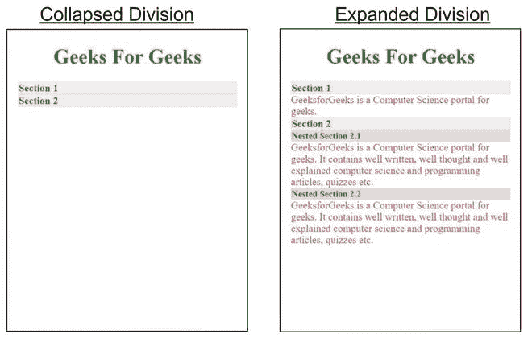

# 如何使用谷歌 AMP-AMP 手风琴创建嵌套手风琴？

> 原文:[https://www . geeksforgeeks . org/如何创建嵌套手风琴-使用-Google-amp-amp-手风琴/](https://www.geeksforgeeks.org/how-to-create-nested-accordion-using-google-amp-amp-accordion/)


**简介:**

有时候，我们有很多内容要展示，为了让网站看起来美观和简短，我们使用了可折叠的文本框。可折叠文本框是标题和内容的组合，通常只有标题是可见的，但是当它被点击时，内容就会显示出来。

**设置:**

*   您必须在标题中导入 amp-accordion 组件才能使用此标签。

```htmlhtml
<script async custom-element="amp-accordion"
       src="https://cdn.ampproject.org/v0/amp-accordion-0.1.js">
</script>
```

*   要制作嵌套手风琴，请使用下面提到的代码:

```htmlhtml
<amp-accordion class="sample" disable-session-states>
  <section>
    <amp-accordion class="nested-accordion">
      <section>
        <h4>Nested Section 1</h4>
        <p>content</p>
      </section>
      <section>
        <h4>Nested Section 2</h4>
        <p>content</p>
      </section>
    </amp-accordion>
  </section>
</amp-accordion>
```

**示例:**

```htmlhtml
<!DOCTYPE html>
<html 
    <head>
        <meta charset="utf-8" />
        <script async src=
"https://cdn.ampproject.org/v0.js">
      </script>
        <script async custom-element="amp-accordion"
                src=
"https://cdn.ampproject.org/v0/amp-accordion-0.1.js">
      </script>
        <link rel="canonical"
              href=
"https://amp.dev/documentation/examples/components/amp-accordion/index.html" />
        <meta name="viewport" 
              content="width=device-width, 
                       minimum-scale=1,
                       initial-scale=1" />
        <style amp-boilerplate>
            body {
                -webkit-animation: 
                  -amp-start 8s steps(1, end) 0s 1 normal both;
                -moz-animation:
                  -amp-start 8s steps(1, end) 0s 1 normal both;
                -ms-animation:
                  -amp-start 8s steps(1, end) 0s 1 normal both;
                animation:
                  -amp-start 8s steps(1, end) 0s 1 normal both;
            }
            @-webkit-keyframes -amp-start {
                from {
                    visibility: hidden;
                }
                to {
                    visibility: visible;
                }
            }
            @-moz-keyframes -amp-start {
                from {
                    visibility: hidden;
                }
                to {
                    visibility: visible;
                }
            }
            @-ms-keyframes -amp-start {
                from {
                    visibility: hidden;
                }
                to {
                    visibility: visible;
                }
            }
            @-o-keyframes -amp-start {
                from {
                    visibility: hidden;
                }
                to {
                    visibility: visible;
                }
            }
            @keyframes -amp-start {
                from {
                    visibility: hidden;
                }
                to {
                    visibility: visible;
                }
            }
        </style>
        <noscript>
            <style amp-boilerplate>
                body {
                    -webkit-animation: none;
                    -moz-animation: none;
                    -ms-animation: none;
                    animation: none;
                }
            </style>
        </noscript>

        <style amp-custom>
            amp-accordion section[expanded] .show-more {
                display: none;
            }

            .nested-accordion h4 {
                font-size: 14px;
                background-color: #ddd;
            }

            amp-accordion.hidden-header section[expanded] h4 {
                border: none;
            }

            /* these styles are not
          required for the samples to work */
            :root {
                --space-2: 1rem;
                /* 16px */
            }

            amp-accordion.sample {
                margin: var(--space-2);
            }

            h1,
            h4 {
                color: forestgreen;
            }
            section {
                color: crimson;
            }
        </style>
        <meta name="robots" 
              content="noindex, nofollow" />
    </head>
    <body>
        <center>
            <h1>
                Geeks For Geeks
            </h1>
        </center>
        <amp-accordion class="sample"
                       disable-session-states>
            <section>
                <h4>Section 1</h4>
                <p>GeeksforGeeks is a Computer 
                  Science portal for geeks.</p>
            </section>
            <section>
                <h4>Section 2</h4>
                <amp-accordion class="nested-accordion">
                    <section>
                        <h4>Nested Section 2.1</h4>
                        <p>GeeksforGeeks is a Computer
                          Science portal for geeks.
                          It contains well written, 
                          well thought and well explained 
                          computer science and programming 
                          articles, quizzes etc.</p>
                    </section>
                    <section>
                        <h4>Nested Section 2.2</h4>
                        <p>GeeksforGeeks is a Computer 
                          Science portal for geeks. It 
                          contains well written, well
                          thought and well explained 
                          computer science and programming 
                          articles, quizzes etc.</p>
                    </section>
                </amp-accordion>
            </section>
        </amp-accordion>
    </body>
</html>
```

**输出:** 