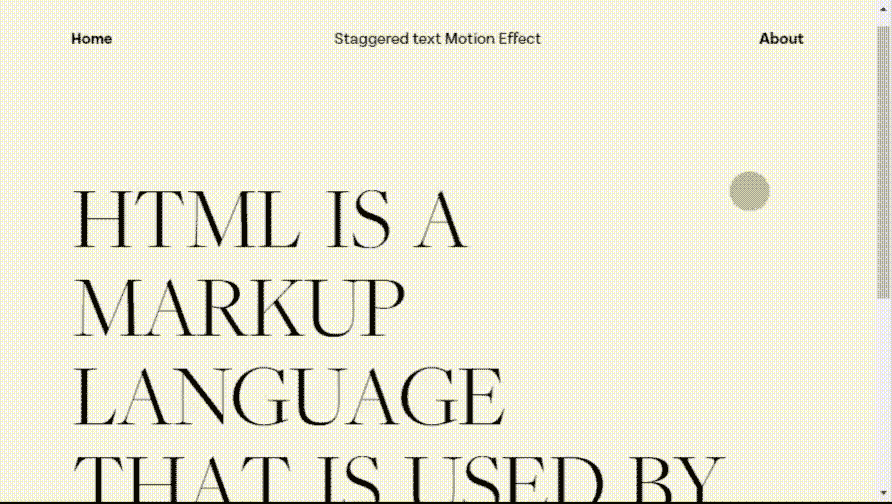
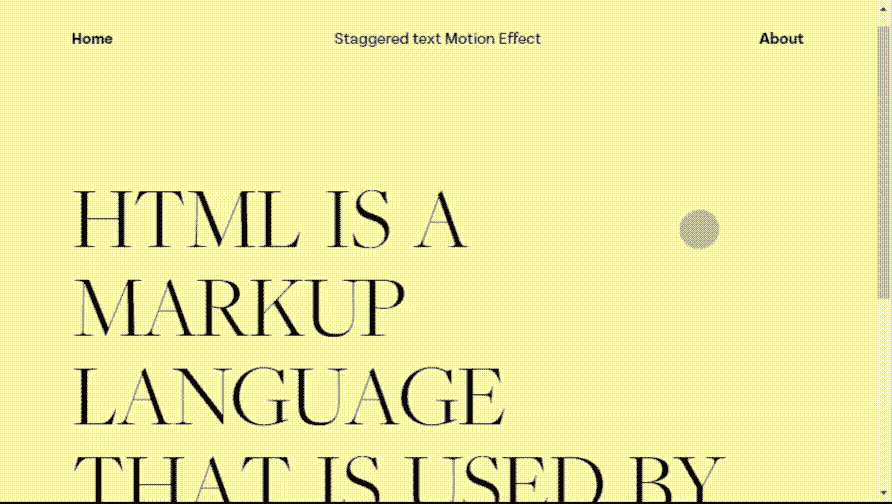

# 如何使用排版插件创建文本交错动画？

> 原文:[https://www . geesforgeks . org/如何创建-文本-交错-动画-使用-排版-插件/](https://www.geeksforgeeks.org/how-to-create-text-stagger-animation-using-typographymotion-plugin/)

在本文中，我们将学习如何使用**排版**插件创建文本交错动画。这个插件完全基于 HTML、CSS 和 JavaScript。这是多种动画技术之一，鼓励从一种状态到另一种状态的增量延迟，从而提供良好的视觉交互应用。

**注意:**请下载工作文件夹中的 [**排版**](https://github.com/codrops/TypographyMotion/) 插件，并将所需文件包含在您的 HTML 代码的头部。

> <link href="”https://use.typekit.net/lwc3axy.css”" rel="”stylesheet”<br/">type = " text/CSS "/>
> <link href = " base . 98 FD 6c 19 . CSS " rel = " style sheet " type = " text/CSS "/><link href = " js . 00 a 46 da . CSS " rel = " style sheet " type = " text/CSS "/>t

**示例:**以下示例演示了帮助开发人员创建交错文本动画的**排版**插件。不同的 HTML 元素如*节*、*图*、*圆*、 *SVG* 被用来开发网页的结构。插件 CSS 文件中的不同类用于内容、框架、段落和光标的视觉效果，如下面的代码所示。在*左右*和*关闭*的“跨”帧上移动光标后，用户可以看到 HTML 段落的文本错开动画。为了更好地理解，请参考输出。

```htmlhtml
<!DOCTYPE html>
<html lang="en" class="no-js">

<head>
    <meta name="viewport" content="width=device-width, 
                       initial-scale=1" />
    <meta name="description" content="Letter stagger animation" />

    <link rel="stylesheet" 
        href="https://use.typekit.net/lwc3axy.css" />
    <link rel="stylesheet" 
        type="text/css" href="base.98fd6c19.css" />
    <script src=
"https://ajax.googleapis.com/ajax/libs/webfont/1.6.26/webfont.js">
    </script>
    <link rel="stylesheet" href="js.00a46daa.css" />
</head>

<body class="loading">
    <main>
        <div class="frame">
            <a class="frame__home">
                <span class="frame__home-title">
                    Home
                </span>
            </a>
            <div class="frame__title-wrap">
                <h1 class="frame__title">
                    Staggered text Motion Effect
                </h1>
            </div>
            <a class="frame__about">
                <span class=
    "frame__about-item frame__about-item--current">
                    About</span>
                <span class="frame__about-item">
                    Close
                </span>
            </a>
        </div>
        <div class="content">
            <section class=
"content__item content__item--home content__item--current">
                <p class="content__paragraph 
 content__paragraph--large content__paragraph--first" 
                    data-splitting="">
                    HTML is a markup language
                </p>
                <p class=
"content__paragraph content__paragraph--large 
 content__paragraph--right content__paragraph--last" 
                    data-splitting="">
                    that is used by the browser 
                    to manipulate text.
                </p>
            </section>
            <section class="content__item content__item--about">
                <p class="content__paragraph" 
                    data-splitting=""><b>HTML</b>
                    stands for</p>
                <p class=
"content__paragraph content__paragraph--right" data-splitting="">
                    Hyper Text Markup Language
                </p>
                <p class="content__paragraph" data-splitting="">
                    It defines link between
                </p>
                <p class="content__paragraph" data-splitting="">
                    Web pages
                </p>
                <figure class="content__figure">
                    
                    <figcaption class="content__figure-caption">
                        Markup language is used to define
                        the text document within tag which 
                        defines the structure of web pages. 
                        This language is used to make notes
                        for the computer text so that a 
                        machine can understand it and
                        manipulate text accordingly.
                        Most of markup languages are human 
                        readable. Language uses tags to define 
                        what manipulation has to be done on 
                        the text.
                    </figcaption>
                </figure>
            </section>
        </div>
    </main>
    <svg class="cursor" width="90" height="90" 
            viewBox="0 0 90 90">
        <circle class="cursor__inner" cx="40" 
                cy="40" r="20">
        </circle>
    </svg>
    <script src="js.00a46daa.js"></script>
</body>

</html>
```

**输出:**

