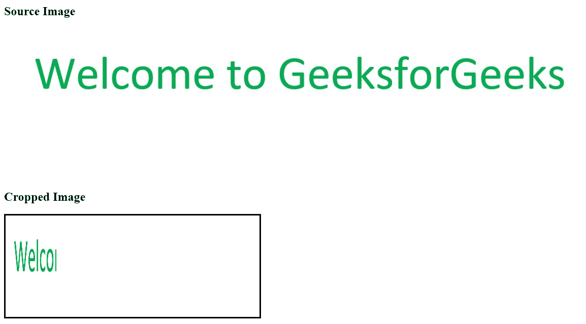

# 如何使用画布裁剪图像？

> 原文:[https://www . geeksforgeeks . org/如何使用画布裁剪图像/](https://www.geeksforgeeks.org/how-to-crop-an-image-using-canvas/)

HTML em 画布元素允许用户在任何网页上绘制图形。它就像一个图形容器来绘制图形，代码中使用了 JavaScript。

```html
<canvas id="Canvas1" width="100" height="100"></canvas>
```

以下是创建画布的属性。还可以添加更多可选属性。画布在 JavaScript 中是通过它的 id 来引用的。

**drawImage()方法:**此方法可用于在网页上绘制图像或视频。它也可以用来绘制图像的一部分。另一个有用的功能是增加或减少图像的大小。

**使用 **drawImage()** 方法裁剪图像:**以便*将源图像裁剪到其目标图像。*需要指定 drawImage()的以下参数。

*   **图像:**要裁剪的图像。
*   **源 X:** 源图像的 x 坐标
*   **源 Y:** 源图像的 y 坐标。
*   **源 W:** 源图像的宽度。
*   **sourceH:** 源图像的高度。
*   **目的地 X:** 目的地图像的 x 坐标。
*   **目的地:**目的地图像的 y 坐标。
*   **目标 W:** 目标图像的宽度。
*   **目的地 H:** 目的地图像的高度。

**语法:**

```html
drawImage(image, sourceX, sourceY, sourceW, sourceH, 
    destinationX,destinationY, destinationW, destinationH)

```

**例:**

## java 描述语言

```html
<!DOCTYPE html>
<html>

<head>
    <title>
        How to crop image
        using canvas?
    </title>
</head>

<body>

    <h2>Source Image</h2>
    

    <h2>Cropped Image</h2>

    <canvas id="myCanvas" width="500" height="200" 
        style="border:3px solid">
        HTML5 canvas tag is not 
        supported by your browser.
    </canvas>

    <script>
        window.onload = function () {
            var canvas = document.getElementById("myCanvas");
            var contex = canvas.getContext("2d");
            var img = document.getElementById("myImage");

            contex.drawImage(img, 10, 10, 
                300, 175, 0, 0, 100, 175);
        }
    </script>
</body>

</html>
```

**Output:**
