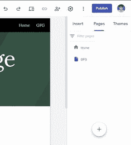
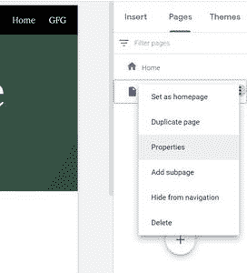
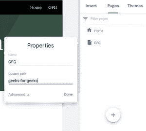

# 如何在新谷歌网站中自定义页面路径？

> 原文:[https://www . geesforgeks . org/how-customize-page-path-in-new-Google-sites/](https://www.geeksforgeeks.org/how-to-customize-page-path-in-new-google-sites/)

有时，我们想建立自己的网站页面路径，如果你在自己的平台上工作，这并不是什么大不了的事情，但如果你不是。谷歌网站为你提供了这样做的手段。要在新的谷歌网站中自定义页面路径，请执行以下步骤:

*   转到编辑器页面右侧的页面面板。

*   将鼠标悬停在页面标题上可查看三点操作菜单。单击它，然后转到属性选项。

*   选择高级选项以查看自定义页面路径选项。输入页面路径并保存。

**注:**

1.  路径中不能有空格，只能有字母数字字符和连字符(-)，否则会显示错误。
2.  您可以有一个以连字符(-)开头的名称。
3.  您不能用此方法设置域。