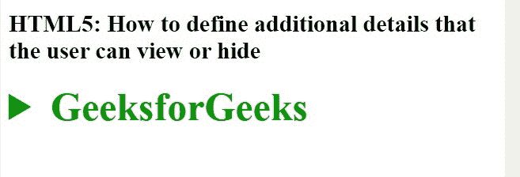

# 如何定义用户可以查看或隐藏的附加细节？

> 原文:[https://www . geesforgeks . org/如何定义用户可以查看或隐藏的附加详细信息/](https://www.geeksforgeeks.org/how-to-define-additional-details-that-the-user-can-view-or-hide/)

在本文中，我们定义了用户可以查看或隐藏的附加详细信息。通过使用文档中的**详细信息**元素，它用于最初隐藏的内容/信息，但如果用户希望查看，可以显示出来。
该标签用于创建用户可以打开或关闭的交互式小部件。打开设置属性时，详细信息标签的内容可见。

**语法:**

```html
<details>
    <summary>  Text content  </summary>
    <div> Content . . . </div>
</details>
```

**示例:**

```html
<!DOCTYPE html> 
<html> 
    <head> 
        <title>
Define additional details that the user can view or hide.
</title> 
        <style> 
            summary { 
                font-size:40px; 
                color:#090; 
                font-weight:bold; 
            } 
        </style> 
    </head> 
    <body> 
        <h2>
Define additional details that the user can view or hide
       </h2>
        <details> 
            <summary>GeeksforGeeks</summary> 
            <p>A computer science portal for geeks</p> 
            <div>It is a computer science portal where you 
            can learn programming.</div> 
        </details> 
    </body> 
</html>
```

**输出:**
**点击详情前元素:**

**点击按钮后:**


**支持的浏览器如下:**

*   谷歌 Chrome
*   微软公司出品的 web 浏览器
*   火狐浏览器
*   歌剧
*   旅行队