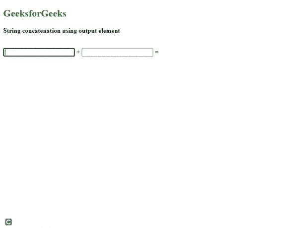
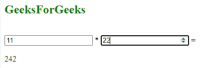

# 如何定义输出元素所属的一个或多个表单？

> 原文:[https://www . geeksforgeeks . org/如何定义输出元素所属的一个或多个表单/](https://www.geeksforgeeks.org/how-to-define-one-or-more-forms-the-output-element-belongs-to/)

本文的目的基本上是理解我们如何在 HTML 中定义一个或多个表单，并指定属于任何特定表单的输出元素。

简单来说，我们将定义一个 id 为引用的表单来指出输出元素**。**

**方法:**为了定义一个或多个表单，我们简单地使用 [*<表单>*](https://www.geeksforgeeks.org/html-form-tag/) 标签后跟表单的内容。因为它在容器标签中终止于*</表单>* 标签。

现在，为了定义输出元素，我们使用 [<输出>](https://www.geeksforgeeks.org/html-output-form-attribute/#:~:text=The%20HTML%20form%20Attribute,contain%20one%20or%20more%20forms.&text=Attribute%20Values%3A%20It%20contains%20single,the%20output%20element%20belongs%20to.) 表单属性，在表单 id 的帮助下指定它所属的表单。

指定输出元素时使用的属性有:

*   为
*   形式
*   名字

**语法:**

```htmlhtml
<output name="variable"  for= "other variable"  
form="form id"></output>
```

**注意:***【名称】*属性用于指定输出变量，*【for】***属性用于对表单块内使用的变量进行操作，*【表单】* 属性用于通过表单的 id 定义表单。**

****示例 1:** 下面的代码使用 [*oninput*](https://www.geeksforgeeks.org/html-oninput-event-attribute/) 属性在运行时执行输出。表单 *id* 是“ *MyForm* ”，它以表单 *id* 为参照，将两个不同的文本串联起来。输出元素在表单块中指定。**

## **超文本标记语言**

```htmlhtml
<!DOCTYPE html>

<html>
  <body>
    <h2 style="color: green">GeeksforGeeks</h2>

    <p><b>String concatenation using output element</b></p>

    <br />
    <!--Creating a form and specifying the operation-->
    <form id="MyForm" 
          oninput="second_output.value=val1.value+val2.value">

      <!--inputs taken-->
      <input type="text" name="val1" id="val1" /> +
      <input type="text" name="val2" id="val2" /> =
      <!--output element used with attributes-->
      <output form="MyForm" 
              name="second_output" 
              for="val1 val2">
      </output>
    </form>
  </body>
</html>
```

****输出:****

**

表单内部的输出元素** 

****示例 2:** 在本例中，我们将定义表单外部的输出元素。**

## **超文本标记语言**

```htmlhtml
<!DOCTYPE html>
<html>
  <body>
    <h2 style="color: green">GeeksForGeeks</h2>
    <br />
    <!--Defined form id and output-->
    <form id="MyForm" 
          oninput="first_output.value=a.value*b.value">

      <!--Specified variables-->
      <input type="number" name="a" id="val1" /> *
      <input type="number" name="b" id="val2" /> =
    </form>
    <br />
    <!--closed form-->
    <!-- defined output element outside the form-->
    <output form="MyForm" 
            name="first_output" 
            for="val1 val2">
    </output>
  </body>
</html>
```

****输出:**正如我们所看到的，可以在表单块内或表单块外定义输出元素。输出保持不变。**

****