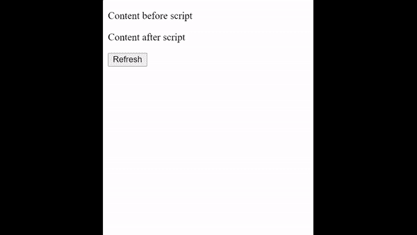
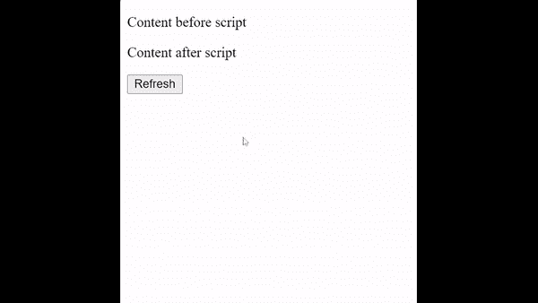

# 如何定义页面解析完毕后执行脚本？

> 原文:[https://www . geeksforgeeks . org/如何定义当页面解析完成时执行脚本/](https://www.geeksforgeeks.org/how-to-define-that-the-script-is-executed-when-the-page-has-finished-parsing/)

在本文中，我们将了解如何在页面解析完成后执行脚本。

当您使用 [**<脚本>** 标签](https://www.geeksforgeeks.org/html-script-tag/)包含任何外部脚本时，您可以选择在 HTML 页面加载完成后加载并执行脚本，为此，您可以使用 [***【延期】***](https://www.geeksforgeeks.org/html-script-defer-attribute/) 关键字作为脚本标签中的属性。当您包含任何可能会阻止页面用户界面呈现的巨大外部脚本时，这非常有用，通过在脚本标记中使用 defer 属性，您可以首先加载 HTML，当用户界面呈现完成时，巨大的脚本将开始执行。

**延迟**是一个布尔属性。它异步加载脚本，并在加载完 HTML 后执行它。delay 关键字只能与**外部脚本**一起使用，这意味着 **src** 属性应该存在。当 DOM 内容准备好了，但是在 ***DOMContentLoaded*** 已经触发之前，它加载脚本。

使用延迟关键字包含的脚本称为**延迟脚本**。

**语法:**

```html
<script src="example.js" ***defer***></script>
```

**示例:**

在这个例子中，我们包含了一个很重的脚本(jQuery 脚本)，并展示了这两个输出是如何不同的。这里可以看到，在第一个输出中，我们没有使用 delay 关键字，而在第二个输出中，我们使用了 delay 关键字。

## 超文本标记语言

```html
<!DOCTYPE html>
<html>
<body>
    <p>Content before script</p>
    <script defer 
            src=
"https://ajax.googleapis.com/ajax/libs/jquery/3.5.1/jquery.min.js">
    </script>
  <p>Content after script</p>
    <button onclick="window.location.reload()">
        Refresh
    </button>
</body>

</html>
```

**输出:**

*   无延迟输出(第二个

    在脚本完全加载后被加载)
    

*   带延迟的输出(脚本在 DOM 内容完全加载后加载)
    