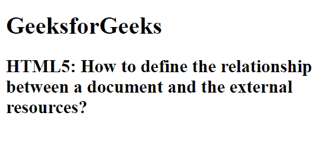

# 如何定义文档与外部资源的关系？

> 原文:[https://www . geesforgeks . org/如何定义文档和外部资源之间的关系/](https://www.geeksforgeeks.org/how-to-define-the-relationship-between-a-document-and-the-external-resources/)

在本文中，我们学习如何通过使用 **<链接>** 元素来创建文档和外部资源之间的关系。此标签用于定义文档和外部资源之间的链接。链接标签用于链接到外部样式表。这个元素可以出现多次，但它只出现在头部。
链接元素为空，仅包含属性。

**语法:**

```htmlhtml
 <link rel="stylesheet" type="text/css" href="styles.css">
```

**示例:**

```htmlhtml
<!DOCTYPE html> 
<html> 

<head> 
    <title>Define the relationship between a 
        document and the external resources
</title> 
    <link rel="stylesheet"
        type="text/css"
        href="styles.css"> 
</head> 

<body> 

    <h1>GeeksforGeeks</h1> 
    <h2>HTML5: How to define the relationship 
between a document and the external resources?
</h2> 

</body> 

</html> 
```

**CSS 代码:**

```htmlhtml
h1 {
    color: green;
}

h1, h2{
    text-align: center;
}
```

**输出:**


**支持的浏览器:**

*   谷歌 Chrome
*   微软公司出品的 web 浏览器
*   火狐浏览器
*   歌剧
*   旅行队