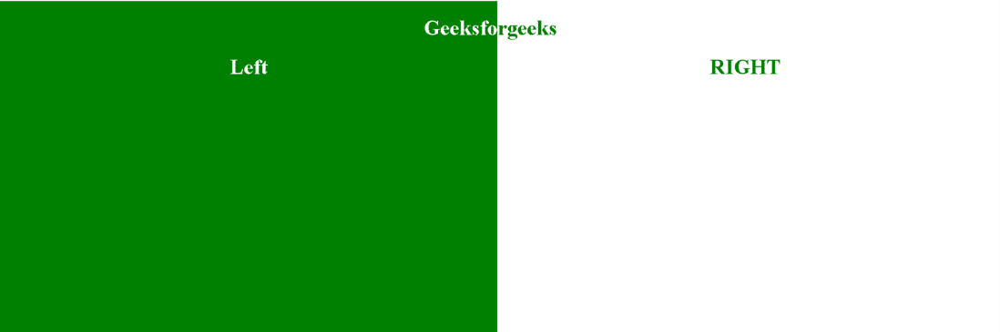
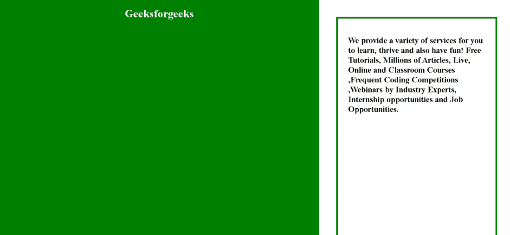

# 如何使用 flexbox 定义两列布局？

> 原文:[https://www . geesforgeks . org/如何使用 flexbox 定义两列布局/](https://www.geeksforgeeks.org/how-to-define-two-column-layout-using-flexbox/)

在本文中，我们将学习如何使用 flexbox 创建两列布局。为了创建两列布局，我们使用**显示**和**弯曲方向**属性。

**方法:**要创建两列布局，首先我们创建一个[**<【div】>**](https://www.geeksforgeeks.org/div-tag-html/)元素，带有属性 [**显示:flex**](https://www.geeksforgeeks.org/css-display-property/) ，它使那一个 div 成为 flexbox 然后添加[**flex-direction:row**](https://www.geeksforgeeks.org/css-flex-direction-property/)，使布局按列显示。然后在上面需要宽度的 div 中添加所需的 div，它们都将作为列出现。在两列布局的情况下，我们在父 div 中添加两个 div。

**语法:**

```html
<div style=" display: flex; flex-direction: row; " ></div>
```

**示例 1:** 两列宽度相等的两列布局。

## 超文本标记语言

```html
<!DOCTYPE html>
<html>

<head>
    <title>Two Column Layout</title>

    <style>
        .body {
            padding: 0;
            margin: 0;
        }

        .Parent {
            display: flex;
            flex-direction: row;
        }

        .child1 {
            width: 50%;
            height: 100vh;
            background-color: green;
            text-align: right;
            color: white;
        }

        .child2 {
            width: 50%;
            color: green;
            height: 100vh;
        }
    </style>
</head>

<body>
    <div class="Parent">
        <div class="child1">
            <h1>Geeksfo</h1>
            <center>
                <h1>Left</h1>
            </center>
        </div>
        <div class="child2">
            <h1>rgeeks</h1>
            <center>
                <h1>RIGHT</h1>
            </center>
        </div>
    </div>
</body>

</html>
```

**输出:**



输出

**示例 2:** 两列宽度不同的两列布局。

## 超文本标记语言

```html
<!DOCTYPE html>
<html>

<head>
    <title>Two Column Layout</title>

    <style>
        .body {
            padding: 0;
            margin: 0;
        }

        .Parent {
            display: flex;
            flex-direction: row;
        }

        .child1 {
            width: 70%;
            height: 100vh;
            background-color: green;
            text-align: center;
            color: white;
        }

        .child2 {
            width: 30%;
            padding: 30px;
            height: 100vh;
            border: green solid 5px;
            margin: 50px;
        }
    </style>
</head>

<body>
    <div class="Parent">
        <div class="child1">
            <h1>Geeksforgeeks</h1>
        </div>
        <div class="child2">
            <h2>
                We provide a variety of services 
                for you to learn, thrive and also 
                have fun! Free Tutorials, Millions 
                of Articles, Live, Online and 
                Classroom Courses ,Frequent Coding 
                Competitions, Webinars by Industry 
                Experts, Internship opportunities 
                and Job Opportunities.
            </h2>
        </div>
    </div>
</body>

</html>
```

**输出:**



输出