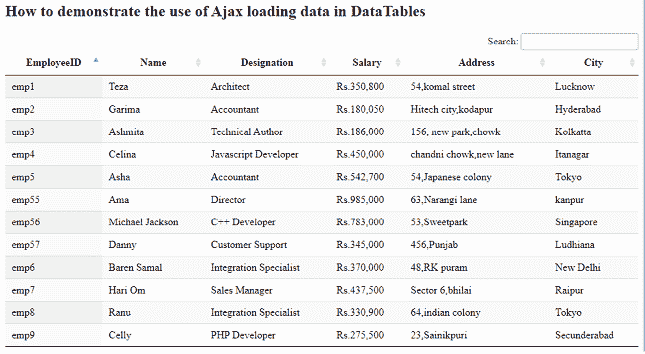
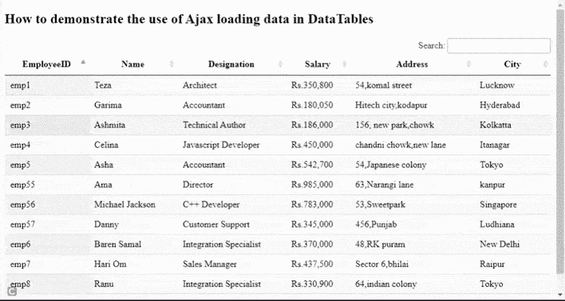

# 如何演示在 DataTables 中使用 Ajax 加载数据？

> 原文:[https://www . geeksforgeeks . org/如何演示 ajax 的使用-在数据表中加载数据/](https://www.geeksforgeeks.org/how-to-demonstrate-the-use-of-ajax-loading-data-in-datatables/)

**数据表** 是一个现代的 jQuery 插件，用于为网页的 HTML 表添加交互和高级控件。这是一个非常简单易用的插件，可以根据应用程序的需要为开发人员的自定义更改提供各种选项。该插件的功能包括分页、排序、搜索和多列排序。

在本文中，我们将演示使用**数据表**插件进行数据对象的 ajax 加载。

**方法:**在以下示例中，**数据表**使用来自普通文件的数据对象作为主要来源。表格中的每一行都显示了一名员工的详细信息。

*   这可以通过使用**数据表**插件应用编程接口的*列数据*选项来实现。
*   源返回一个对象数组，用于显示 HTML 表中的数据。

数据文件中数据行的结构示例如下。它只是表示键和值对中的数据，如下所示。


具有键和值对的员工数据对象

需要实现的预编译文件有

CSS:

```html
https://cdn.datatables.net/1.10.22/css/jquery.dataTables.min.css
```

**JavaScript:**

```html
https://code.jquery.com/jquery-3.5.1.js
https://cdn.datatables.net/1.10.22/js/jquery.dataTables.min.js
```

**示例:**下面的代码演示了从文件“nestedData.txt”中提取雇员数据对象，并使用插件显示 HTML 表中的所有行。

## 超文本标记语言

```html
<!DOCTYPE html>
<html>

<head>

    <meta content="initial-scale=1, maximum-scale=1, 
        user-scalable=0" name="viewport" />
    <meta name="viewport" content="width=device-width" />

    <!-- Datatable plugin CSS file -->
    <link rel="stylesheet" href=
"https://cdn.datatables.net/1.10.22/css/jquery.dataTables.min.css" />

    <!-- jQuery library file -->
    <script type="text/javascript" 
        src="https://code.jquery.com/jquery-3.5.1.js">
    </script>

    <!-- Datatable plugin JS library file -->
    <script type="text/javascript" src=
"https://cdn.datatables.net/1.10.22/js/jquery.dataTables.min.js">
    </script>
</head>

<body>
    <h2>
        How to demonstrate the use of Ajax 
        loading data in DataTables
    </h2>

    <!-- HTML table with employee data -->
    <table id="tableID" class="display" style="width:100%">
        <thead>

            <!-- Column headers with employee data -->
            <tr>
                <th>EmployeeID</th>
                <th>Name</th>
                <th>Designation</th>
                <th>Salary</th>
                <th>Address</th>
                <th>City</th>
            </tr>
        </thead>
    </table>

    <script>

        /* Initialization of datatable */
        $(document).ready(function () {

            /* Datatable access by using table ID */
            $('#tableID').DataTable({
                "info": false,

                /* Set pagination as false or 
                true as per need */
                "paging": false,

                /* Name of the file source 
                for data retrieval */
                "ajax": 'nestedData.txt',
                "columns": [

                    /* Name of the keys from 
                    data file source */
                    { "data": "employee_id" },
                    { "data": "name" },
                    { "data": "designation" },
                    { "data": "salary" },
                    { "data": "address" },
                    { "data": "city" }
                ]
            });
        });
    </script>
</body>

</html>
```

**nestedData.txt:** 以下是上述 HTML 代码中使用的文件“nestedData.txt”的内容。

```html
{
  "data": [
    {
      "employee_id": "emp1",
      "name": "Teza",
      "designation": "Architect",
      "salary": "Rs.350,800",     
      "city": "Lucknow",
      "address": "54,komal street"
    },
    {
      "employee_id": "emp2",
      "name": "Garima",
      "designation": "Accountant",
      "salary": "Rs.180,050",    
      "city": "Hyderabad",
      "address": "Hitech city,kodapur"
    },
    {
      "employee_id": "emp3",
      "name": "Ashmita",
      "designation": "Technical Author",
      "salary": "Rs.186,000",    
      "city": "Kolkatta",
      "address": "156, new park,chowk"
    },
    {
      "employee_id": "emp4",
      "name": "Celina",
      "designation": "Javascript Developer",
      "salary": "Rs.450,000",     
      "city": "Itanagar",
      "address": "chandni chowk,new lane"
    },
    {
      "employee_id": "emp5",
      "name": "Asha",
      "designation": "Accountant",
      "salary": "Rs.542,700",   
      "city": "Tokyo",
      "address": "54,Japanese colony"
    },
    {
      "employee_id": "emp6",
      "name": "Baren Samal",
      "designation": "Integration Specialist",
      "salary": "Rs.370,000",    
      "city": "New Delhi",
      "address": "48,RK puram"
    },
    {
      "employee_id": "emp7",
      "name": "Hari Om",
      "designation": "Sales Manager",
      "salary": "Rs.437,500",     
      "city": "Raipur",
      "address": "Sector 6,bhilai"
    },
    {
      "employee_id": "emp8",
      "name": "Ranu",
      "designation": "Integration Specialist",
      "salary": "Rs.330,900",     
      "city": "Tokyo",
      "address": "64,indian colony"
    },
    {
      "employee_id": "emp9",
      "name": "Celly",
      "designation": "PHP Developer",
      "salary": "Rs.275,500",    
      "city": "Secunderabad",
      "address": "23,Sainikpuri"
    },
   {
      "employee_id": "emp55",
      "name": "Ama",
      "designation": "Director",
      "salary": "Rs.985,000",    
      "city": "kanpur",
      "address": "63,Narangi lane"
    },
    {
      "employee_id": "emp56",
      "name": "Michael Jackson",
      "designation": "C++ Developer",
      "salary": "Rs.783,000",    
      "city": "Singapore",
      "address": "53,Sweetpark"
    },
    {
      "employee_id": "emp57",
      "name": "Danny",
      "designation": "Customer Support",
      "salary": "Rs.345,000",    
      "city": "Ludhiana",
      "address": "456,Punjab"
    }
  ]
}
```

**输出:**

**执行代码前:**



员工数据

**执行完代码后:** 下面的输出显示了对指定为“会计师”的员工或后缀为“开发人员”的字符串进行“搜索”操作的表格。另一个搜索是城市“海得拉巴”等等。

****