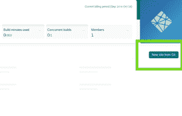
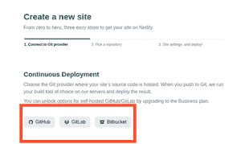
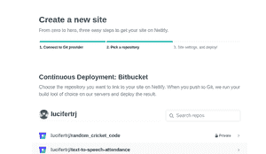
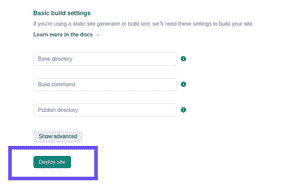
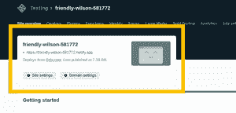
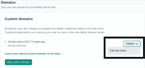
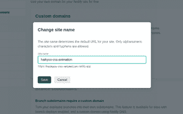

# 如何在 Netlify 上部署网站？

> 原文:[https://www . geeksforgeeks . org/net lify 网站部署方法/](https://www.geeksforgeeks.org/how-to-deploy-website-on-netlify/)

你的网站已经准备好了，却不知道如何去接触观众。我们大多数程序员使用 HTML、CSS 和 JavaScript 创建令人惊叹的网站，并且只需将它们保存在本地或像 GitHub 和 BitBucket 这样的远程主机服务上。现在，如果你需要非程序员来查看你的工作呢？这就是为什么在线部署 web 应用程序变得非常重要的原因。Netlify 让你的工作变得轻松。您可以轻松部署使用 Netlify 上的 react 创建的网站或网络应用程序。Netlify 易于使用、可扩展且用户友好。开始使用 Netlify 的唯一要求是您需要一个 GitHub 或 Gitlab 或 BitBucket 帐户。如果您有任何这些，然后遵循下面的逐步教程，如果没有创建您的帐户。

在继续之前，我们假设您已经在 Git 主机服务上创建了一个存储库，并提交了所有的网站文件。如果你是新手，不知道如何使用 Git，你可以看看这个:[Git 和 Github 终极指南](https://www.geeksforgeeks.org/ultimate-guide-git-github/)

**下面是在 Netlify 上部署网站的分步过程。**

**步骤 1:** 在 Netlify 上创建您的帐户。这是完全免费的，所以继续创建您的 Netlify 帐户。一旦你验证了你的账户，你需要回答 7 个简单的问题。

**步骤 2:** 从 GIT 创建一个新站点。请记住已经创建了您的存储库，一旦创建完成，您需要遵循 3 个主要步骤。

**步骤 3:** 连接 Git 提供者。现在选择一个 Git 主机提供商，您已经在那里创建了您的存储库。我将选择 Bitbucket，因为我的项目和存储库是在 BitBucket 中创建的。

**第四步:**选择一个仓库。一旦您获得了 Git 主机提供者的授权，您现在需要选择一个您已经创建的存储库。

**步骤 5:** 一旦选择了您的存储库，就部署您的站点。默认情况下，基本目录是主目录。您现在只需点击部署站点。

**第六步:**等待几秒钟，你会得到一个绿色的成功链接。Netlify 将为您的站点生成一个随机名称，并有自己的域名，即 netlify.app

**步骤 7:** 现在您的站点已经成功部署，您可以编辑站点名称，转到域设置，选择选项，然后编辑站点名称。输入站点名称并保存。

 