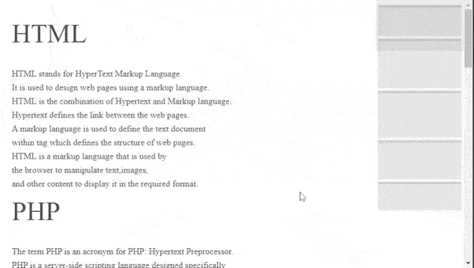

# 如何使用页面地图插件设计网页导航地图？

> 原文:[https://www . geesforgeks . org/how-design-navigation-map-for-web-page-map-plugin/](https://www.geeksforgeeks.org/how-to-design-navigation-map-for-web-pages-using-pagemap-plugin/)

在本文中，我们将学习如何使用 [**页面地图**](https://github.com/lrsjng/pagemap) 插件设计单页面网站导航系统的迷你地图。这个插件完全是一个基于 HTML、JavaScript 和 CSS 的工具。

请下载预编译的库文件用于代码实现。

开发人员可以通过下面的 CSS 代码来固定地图在屏幕上的位置。加入上面 HTML 代码的样式部分。

```html
#map {
    position: fixed;
    top: 0;
    right: 0;
    width: 200px;
    height: 100%;
    z-index: 100;
}

```

迷你地图的初始化和样式化在代码的脚本部分处理。下面的代码片段只是为开发人员提供的一个例子，他们可以根据自己的需要进行修改。

```html
pagemap(document.querySelector('#map'), {
     /* Another HTML container ID  */
    viewport: document.querySelector('#container'),
    styles: {
        'h1,a': 'rgba(0,0,0,0.10)',
        'h2,h3,h4': 'rgba(0,0,0,0.08)'
    },
    back: 'rgba(0,0,0,0.02)',
    view: 'rgba(0,0,0,0.05)',
    drag: 'rgba(0,0,0,0.10)',
    interval: 50
});

```

**示例:**下面的代码演示了一个在网页右上角导航网页的小地图。给你的网页添加一个*画布*标签。

```html
<!DOCTYPE html>
<html>

<head>
    <meta charset="utf-8">
    <link rel="stylesheet" href="styles.css">
    <style>
        p {
            width: 650px;
        }
    </style>
</head>

<body id="bodyID">
    <main>
        <section>
            <h1>HTML</h1>

            <p> 
                HTML stands for HyperText Markup 
                Language.<br/> It is used to design 
                web pages using a markup language.
                <br/> HTML is the combination of 
                Hypertext and Markup language.
            </p>

            <p> 
                Hypertext defines the link between 
                the web pages.<br/> A markup language
                is used to define the text document 
                <br/> within tag which defines the 
                structure of web pages.
            </p>

            <p> 
                HTML is a markup language that is 
                used by <br/> the browser to 
                manipulate text,images, <br/> and 
                other content to display it in the 
                required format.
            </p>
        </section><br/>

        <section>
            <h1>PHP</h1>

            <p>
                The term PHP is an acronym for PHP: 
                Hypertext Preprocessor.<br/> PHP is
                a server-side scripting language 
                designed specifically<br/> for web 
                development.
            </p>

            <p>
                PHP can be easily embedded in HTML 
                files and HTML codes<br/> can also 
                be written in a PHP file.
            </p>

            <p>
                The thing that differentiates PHP 
                with client-side <br/> language like 
                HTML is,PHP codes are executed on 
                the<br/> server whereas HTML codes 
                are directly rendered on the browser.
            </p>

            <p>
                The term PHP is an acronym for PHP: 
                Hypertext Preprocessor.<br/> PHP is
                a server-side scripting language 
                designed specifically<br/> for web 
                development.
            </p>

            <p>
                PHP can be easily embedded in HTML 
                files and HTML codes can<br/> also 
                be written in a PHP file.
            </p>

            <p>
                The thing that differentiates PHP 
                with client-side language<br/> like 
                HTML is,PHP codes are executed on 
                the server <br/> whereas HTML codes
                are directly rendered on the browser.
            </p>
        </section><br/>

        <section>
            <h1>CSS</h1>

            <p>
                Cascading Style Sheets, fondly referred 
                to as CSS,<br/> is a simply designed 
                language intended to simplify <br/> 
                the process of making web pages 
                presentable. 
            </p>

            <p>
                CSS allows you to apply styles to 
                web pages.
            </p>

            <p>
                More importantly, CSS enables you to 
                do this independent<br/> of the HTML 
                that makes up each web page.
            </p>

            <p>
                Cascading Style Sheets, fondly referred 
                to as CSS,<br/> is a simply designed 
                language intended to simplify <br/> the
                process of making web pages presentable.
            </p>

            <p>
                CSS allows you to apply styles to 
                web pages.
            </p>

            <p>
                More importantly, CSS enables you to 
                do this<br/> independent of the HTML 
                that makes up each web page.
            </p>

            <p>
                CSS allows you to apply styles to 
                web pages.
            </p>

            <p>
                More importantly, CSS enables you to 
                do this <br/> independent of the HTML 
                that makes up each web page.
            </p>
        </section><br/>

        <section>
            <h1>JavaScript</h1>

            <p> 
                JavaScript is a lightweight, cross-
                platform and<br/> interpreted 
                scripting language.
            </p>

            <p>
                It is well-known for the development 
                of web pages,<br/> many non-browser 
                environments also use it.
            </p>

            <p>
                JavaScript can be used for Client-side 
                developments <br/> as well as 
                Server-side developments.
            </p>

            <p> 
                JavaScript is a lightweight, cross-
                platform and<br/> interpreted scripting
                language.
            </p>

            <p>
                It is well-known for the development 
                of web pages,<br/> many non-browser 
                environments also use it.
            </p>

            <p>
                JavaScript can be used for Client-side 
                developments <br/> as well as Server-
                side developments.
            </p>
        </section><br/>

        <section>
            <h1>Python</h1>

            <p> 
                Python is a high-level, general-purpose
                and a<br/> very popular programming 
                language.
            </p>

            <p>
                Python programming language (latest 
                Python 3) is<br/> being used in web 
                development, Machine Learning applications,
                <br/> along with all cutting edge technology
                in Software Industry.
            </p>

            <p>
                Python Programming Language is very well 
                suited <br/> for Beginners, also for 
                experienced programmers with <br/> other 
                programming languages like C++ and Java.
            </p>
        </section>
    </main>

    <canvas id="map"></canvas>

    <script src="pagemap.min.js"></script>

    <script>

        /* mini-map initialization */
        pagemap(document.querySelector('#map'));
    </script>
</body>

</html>
```

**输出:**
