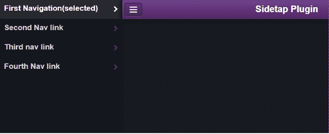
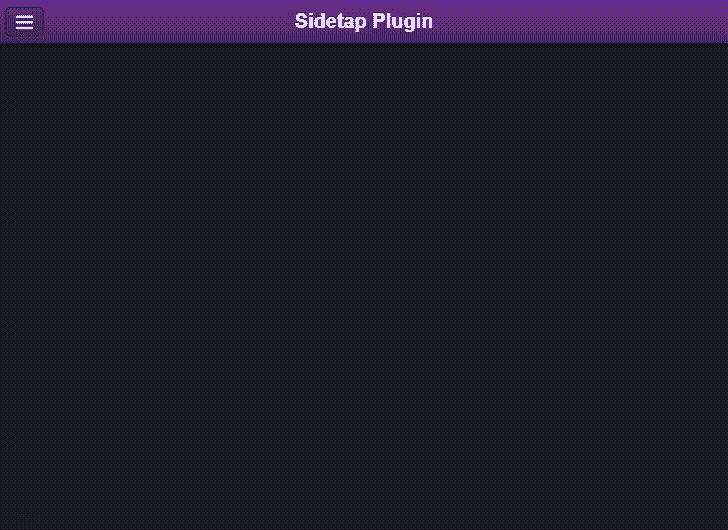

# 如何使用 Sidetap 插件为手机设计侧导航？

> 原文:[https://www . geesforgeks . org/how-to-design-side-navigation-for-mobile-use-side AP-plugin/](https://www.geeksforgeeks.org/how-to-design-side-navigation-for-mobile-using-sidetap-plugin/)

在本文中，我们将学习如何使用**侧钻**插件为移动网页界面设计侧导航功能。这个插件是一个非常轻量级和独立于平台的框架，并且提供了易于使用的语法和灵活性。它完全基于 HTML、JavaScript 和 CSS。

请从[链接](https://github.com/harvesthq/sidetap)下载所需的预编译文件，并保存在您的工作文件夹中以供执行。在包含源代码时，请注意正确的文件路径。

**进场:**

1.  **创建 HTML 结构:****侧图**插件使用了一个非常具体的 HTML 结构，所有预编译的库都在标题部分，如下面的最终代码所示。插件特定类与 HTML“div”一起使用，后者具有带有*类的导航面板和带有*类的内容面板。用于主体内容的类是 *class="stp-content-body"* 。**

*   **Instantiate Sidetap:** In your mobile web app, the following syntax is used to create a reference to Sidetap. This is written in the script section of the HTML code.

    ```htmlhtml
    var my_variable = new sidetap();
    ```

    **最终代码:**

    ```htmlhtml
    <!DOCTYPE html>
    <html>

    <head>
        <meta charset='utf-8' />
        <meta name="viewport" content=
            "width=device-width,
            initial-scale=1, maximum-scale=1" />

        <!-- Sidetap libraries -->
        <link type="text/css" rel="stylesheet" 
            media="screen" href="sidetap.css" />
        <link type="text/css" rel="stylesheet" 
            media="screen" 
            href="theme/default/default.css" />
        <!-- Sidetap libraries -->
    </head>

    <body>
        <div class="sidetap">
            <div class="stp-nav">
                <div>
                    <!-- The sidetap navigation links 
                        can be given here -->
                    <nav>
                        <a href="#" class="selected">
                            First Navigation(selected)
                        </a>
                        <a href="#">Second Nav link</a>
                        <a href="#">Third nav link</a>
                        <a href="#">Fourth Nav link</a>
                    </nav>
                </div>
            </div>

            <div class="stp-content" id="content">

                <!-- Content Divs  -->
                <div class="stp-content-panel">

                    <!-- The header contains the 
                        class for menu icon -->
                    <header>
                        <a href="javascript:void(0)" 
                            class="header-button icon menu">
                            <span>Menu</span></a>
                        <h1> Sidetap Plugin</h1>
                    </header>

                    <div class="stp-content-frame">
                        <div class="stp-content-body">
                            <div>
                                <p>Body content.</p>
                            </div>
                        </div>
                    </div>
                </div>
                <!-- End content Div -->
            </div>
        </div>

        <!-- The jQuery library -->
        <script type="text/javascript" 
            src="jquery.1.7.2.js">
        </script>

        <!-- The JavaScript library for 
            Sidetap plugin -->
        <script type="text/javascript" 
            src="sidetap.js">
        </script>

        <script>
            /* Instantiate sidetap in the top 
            left side, refer output */
            var sidetapVar = sidetap();

            /* On click of the header menu 
            button icon */

            /* The navigation is toggled */
            $(".header-button.menu")
                .on("click", sidetapVar.toggle_nav)
        </script>
    </body>

    </html>
    ```

    **输出:**
    
    