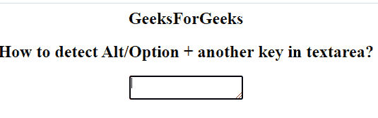
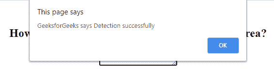

# 如何检测 textarea 中的 Alt/Option +另一个键？

> 原文:[https://www . geesforgeks . org/如何检测-alt-option-另一个键入文本区/](https://www.geeksforgeeks.org/how-to-detect-alt-option-another-key-in-textarea/)

在本文中，我们需要使用 HTML 和 JavaScript 来检测文本区域中的 Alt/Option +另一个键。它检测两个键，即 **Alt + h** 。当有人按下(键盘上的)一个键时，发生**按下键事件**。

**语法:**

```html
<textarea onkeydown="newScript" >
```

**示例:**下面的代码说明了当用户按下文本区域上的 Alt + h 键时检测到的情况。它将产生警报信息。

## 超文本标记语言

```html
<!DOCTYPE html>
<html>

<body>
    <h2>GeeksForGeeks</h2>

    <h2>
        How to detect Alt/Option +
        another key in textarea?
    </h2>

    <textarea onkeydown="myFunction(event);">
    </textarea>

    <script>
        function myFunction(e) {

            // It check both  altKey + 'A' or 'a' 
            if (e.altKey && e.key === "h") {
                alert(
    "GeeksforGeeks says Detection successfully ");
            }
        }
    </script>
</body>

</html>
```

**Note:** We can also use ASCII code for detecting the keys.
**Output:**

*   **按 Alt + h 键前:** 

*   **按下 Alt + h 键后** 

***支持的浏览器如下:***

*   谷歌 Chrome
*   微软公司出品的 web 浏览器
*   火狐浏览器
*   歌剧
*   旅行队