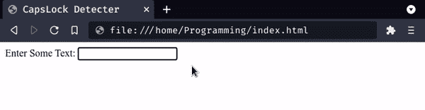

# 如何检测大写锁定键是否开启？

> 原文:[https://www . geesforgeks . org/如何检测-大写-锁定-钥匙打开-打开或不打开/](https://www.geeksforgeeks.org/how-to-detect-caps-lock-key-turned-on-or-not/)

在使用某种 web 应用程序时，我们经常需要了解关于用户交互的各种信息，以便相应地执行我们的功能，也就是说，我们使用 API 来处理按钮点击、监听按键的方法等。同样，可能有些情况下我们需要知道 Caps Lock 是否处于活动状态。这方面的一个用例可以是身份验证系统，在该系统中，当输入密码时 caps lock 打开时，应用程序会通知用户。希望 javascript 提供了解决这种情况的方法和技术，我们将在本文中讨论所有内容。

**KeyboardEvent:** 这个 Web API 是用来处理用户通过键盘进行交互的，各种事件描述的是已经发生了哪种活动。

*   **按下键:**按下键时触发。
*   **按键:释放按键时**触发。

由于键盘而发生的事件属于键盘事件对象。

**修饰键:**这些键与其他键一起使用，以执行一些特殊目的或快捷方式。有两种类型的修饰键在按下时保持激活状态，即 shift、ctrl、alt 等。其他的是当按下时激活的和当再次按下时去激活的，即有头锁等。

**getModifierState:** 这是 KeyboardEvent 对象的方法，并返回一个**布尔值**，表示在该事件中给定的修饰键是否被激活。

**语法:**

```htmlhtml
const isActive = event.getModifierState(keyString);

// It will return a boolean 
// keyString: A string to be passed i.e. "Alt", 
// "CapsLock", "Control", "NumLock", etc.
```

**示例:**现在我们将检测 Capslock 键是否打开。在这里，我们将演示一个简单的例子，其中我们将检测大写锁定键的激活状态。

**步骤 1:** 这里我们创建了一个简单的 HTML 页面，其中包含一个 div，其中包含一些文本和输入元素，以及一个显示警告文本的段落。

## index.html

```htmlhtml
<!DOCTYPE html>
<html lang="en">

<head>
    <title>CapsLock Detecter</title>
</head>

<body>
    <div>Enter Some Text: <input id="text" type="text" /></div>
    <p id="warn" style="display:none; color:red">
        Warning: CapsLock is On!
    </p>

    <script src="./index.js"></script>
</body>

</html>
```

**第二步:**这个 index.js 文件附加在前一个 HTML 文件的脚本标签中。我们只是提取输入元素来添加一个事件监听器，我们还提取警告文本段落来改变它的样式。之后，我们将一个回调函数传递给方法**添加事件监听器**，用于“**按键**”事件。在该功能中，我们正在检查 caps lock 键是打开的还是释放的。

## index.js

```htmlhtml
// Get the input field
const input = document.getElementById("text");

// Get the warning warnText
const warnText = document.getElementById("warn");

// add event listener to input 
input.addEventListener("keyup", function(event) {

    // If capslock is pressed, display the warnText
    if (event.getModifierState("CapsLock")) {
      warnText.style.display = "block"; 
    } else {
      warnText.style.display = "none";
    }
});
```

**输出:**这将是上述代码片段的输出，每次我们按键时，它都会在按键释放时生成一个事件。



**解释:**这里我们已经输入了“abc ”,一旦我们按下 caps lock，事件就会生成，然后功能会检测到它，并改变 p 元素的出现。当我们再次按下 caps lock 时，事件将在按键释放时生成，功能会检测到它，因此下次我们按下任何按键时，p 标签都会隐藏起来。