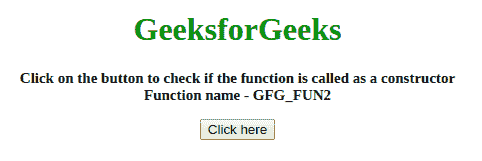
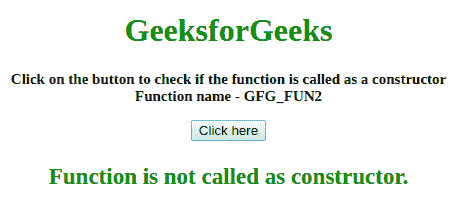
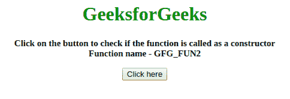
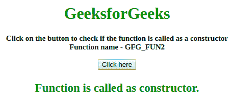

# 如何检测一个函数是否被调用为构造函数？

> 原文:[https://www . geesforgeks . org/如何检测函数是否被称为构造函数/](https://www.geeksforgeeks.org/how-to-detect-if-a-function-is-called-as-constructor/)

问题是识别函数调用是否是构造函数调用。

**方法 1:**

*   使用属性的**实例。**
*   如果当前实例是函数的实例，那么这是一个构造函数调用。
*   否则，这是一个通用函数调用。

**示例:**该示例实现了上述方法。

```
<!DOCTYPE HTML>
<html>

<head>
    <title>
        How to detect if a function is called
        as constructor in JavaScript ?
    </title>
</head>

<body style="text-align:center;">

    <h1 style="color:green;"> 
        GeeksForGeeks 
    </h1>

    <p id="GFG_UP" style=
        "font-size: 15px; font-weight: bold;">
    </p>

    <button onclick="gfg_Run()">
        Click here
    </button>

    <p id="GFG_DOWN" style=
        "font-size: 23px; font-weight: bold; color: green; ">
    </p>

    <script>
        var el_up = document.getElementById("GFG_UP");
        var el_down = document.getElementById("GFG_DOWN");

        el_up.innerHTML = "Click on the button to check if the "
                    + "function is called as a constructor<br>"
                    + "Function name - GFG_FUN2";

        function GFG_FUN2(val) {
            var temp = false;

            if (this instanceof GFG_FUN2 && 
                    !this.__previouslyConstructedByVal) {
                temp = true;
                this.__previouslyConstructedByVal = true;
            }

            return temp;
        }

        function gfg_Run() {

            // Function call 
            var temp = GFG_FUN2();

            if (temp == true) {
                el_down.innerHTML = 
                        "Function is called as constructor.";
            } 
            else {
                el_down.innerHTML = 
                        "Function is not called as constructor.";
            }
        }
    </script>
</body>

</html>
```

**输出:**

*   **点击按钮前:**
    
*   **点击按钮后:**
    

**方法 2:**

*   使用**。建造师**属性。
*   如果 **this.constructor** 等于函数名，那么这是一个构造函数调用。
*   否则，这是一个通用函数调用。

**示例:**这个示例说明了上面讨论的方法。

```
<!DOCTYPE HTML>
<html>

<head>
    <title>
        Detect function is called as constructor
    </title>
</head>

<body style="text-align:center;" id="body">
    <h1 style="color:green;">  
            GeeksforGeeks  
        </h1>
    <p id="GFG_UP" style="font-size: 15px; font-weight: bold;">
    </p>
    <button onclick="gfg_Run()">
        Click here
    </button>
    <p id="GFG_DOWN" 
       style="font-size: 23px; font-weight: bold; color: green; ">
    </p>
    <script>
        var el_up = document.getElementById("GFG_UP");
        var el_down = document.getElementById("GFG_DOWN");
        el_up.innerHTML = "Click on the button to check if the " +
                          "function is called as a constructor<br>" + 
                          "Function name - GFG_FUN2";

        function GFG_FUN2(val) {
            var temp = false;
            if (this.constructor == GFG_FUN2) {
                temp = true;
            }
            if (temp == true) {
                el_down.innerHTML = "Function is called as constructor.";
            } else {
                el_down.innerHTML = "Function is not called as constructor.";
            }
        }

        function gfg_Run() {
            new GFG_FUN2(); //Call to the function.
        }
    </script>
</body>

</html>
```

**输出:**

*   **点击按钮前:**
    
*   **点击按钮后:**
    