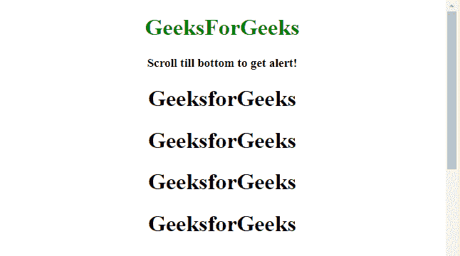
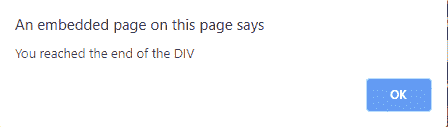
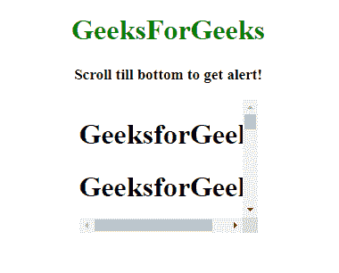
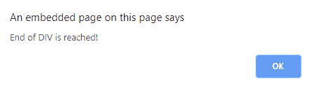

# 如何检测用户何时滚动到 div 底部？

> 原文:[https://www . geeksforgeeks . org/如何在用户滚动到 div 底部时进行检测/](https://www.geeksforgeeks.org/how-to-detect-when-user-scrolls-to-the-bottom-of-a-div/)

任务是当用户使用 JQuery 滚动到底部时，检测

元素的底部。这里讨论几个方法。

*   **[jQuery on()](https://www.geeksforgeeks.org/jquery-on-with-examples/) Method:**
    This method adds one or more event handlers for the selected elements and child elements.
    **Syntax:**

    ```
    $(selector).on(event, childSelector, data, function, map)

    ```

    **参数:**

    *   **事件:**此参数为必填项。它指定一个或多个要附加到选定元素的事件或命名空间。
        在多个事件值的情况下，这些值用空格隔开。事件必须有效。
    *   **儿童选择器:**该参数可选。它指定事件处理程序应该只附加到已定义的子元素。
    *   **数据:**此参数为可选。它指定要传递给函数的附加数据。
    *   **功能:**此参数为必选项。它指定事件发生时要运行的函数。
    *   **映射:**它指定了一个事件映射({event:func()，event:func()，…})，该事件映射有一个或多个要添加到所选元素的事件，以及事件发生时要运行的函数。

**示例 1:** 本示例提醒**当用户滚动到 class = div 的 div 元素的底部时，您已经到达了 DIV 的末尾**。

```
<!DOCTYPE HTML>
<html>

<head>
    <title>
        JQuery 
      | Detecting when user scrolls to bottom of div.
    </title>
</head>
<script src=
"https://ajax.googleapis.com/ajax/libs/jquery/3.4.0/jquery.min.js">
</script>

<body style="text-align:center;" 
      id="body">
    <h1 style="color:green;"> 
            GeeksForGeeks 
        </h1>
    <p id="GFG_UP" 
       style="font-size: 17px;
              font-weight: bold;">
    </p>
    <div class="div">
        <h1>GeeksforGeeks</h1>
        <h1>GeeksforGeeks</h1>
        <h1>GeeksforGeeks</h1>
        <h1>GeeksforGeeks</h1>
        <h1>GeeksforGeeks</h1>
        <h1>GeeksforGeeks</h1>
        <h1>GeeksforGeeks</h1>
        <h1>GeeksforGeeks</h1>
        <h1>GeeksforGeeks</h1>
        <h1>GeeksforGeeks</h1>
        <h1>GeeksforGeeks</h1>
        <h1>GeeksforGeeks</h1>
        <h1>GeeksforGeeks</h1>
    </div>
    <script>
        $('#GFG_UP').text(
          'Scroll till bottom to get alert!');

        $(window).on('scroll', function() {
            if ($(window).scrollTop() >= $(
              '.div').offset().top + $('.div').
                outerHeight() - window.innerHeight) {

                alert('You reached the end of the DIV');
            }
        });
    </script>
</body>

</html>
```

**输出:**

*   **到达底部前:**
    
*   **到达底部后:**
    

**例 2:** 本例提醒**到达 DIV 结束！**当用户滚动到 class = div 的 div 元素底部时。

```
<!DOCTYPE HTML>
<html>

<head>
    <title>
        JQuery 
      | Detecting when user scrolls to bottom of div.
    </title>
</head>
<script src=
 "https://ajax.googleapis.com/ajax/libs/jquery/3.4.0/jquery.min.js">
</script>

<body style="text-align:center;" id="body">
    <h1 style="color:green;"> 
            GeeksForGeeks 
        </h1>
    <p id="GFG_UP"
       style="font-size: 17px;
              font-weight: bold;">
    </p>
    <center>
        <div class="div" style="width:200px;
                                height:150px;
                                overflow:auto;">
            <h1>GeeksforGeeks</h1>
            <h1>GeeksforGeeks</h1>
            <h1>GeeksforGeeks</h1>
            <h1>GeeksforGeeks</h1>
            <h1>GeeksforGeeks</h1>
            <h1>GeeksforGeeks</h1>
            <h1>GeeksforGeeks</h1>
            <h1>GeeksforGeeks</h1>
            <h1>GeeksforGeeks</h1>
            <h1>GeeksforGeeks</h1>
            <h1>GeeksforGeeks</h1>
            <h1>GeeksforGeeks</h1>
            <h1>GeeksforGeeks</h1>
        </div>
    </center>
    <script>
        $('#GFG_UP').text('Scroll till bottom to get alert!');
        jQuery(function($) {
            $('.div').on('scroll', function() {
                if ($(this).scrollTop() +
                    $(this).innerHeight() >= 
                    $(this)[0].scrollHeight) {

                    alert('End of DIV is reached!');
                }
            });
        });
    </script>
</body>

</html>
```

**输出:**

*   **到达底部前:**
    
*   **到达底部后:**
    

jQuery 是一个开源的 JavaScript 库，它简化了 HTML/CSS 文档之间的交互，它以其“少写多做”的理念而闻名。
跟随本 [jQuery 教程](https://www.geeksforgeeks.org/jquery-tutorials/)和 [jQuery 示例](https://www.geeksforgeeks.org/jquery-examples/)可以从头开始学习 jQuery。