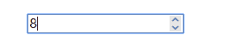
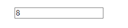
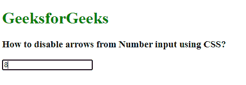
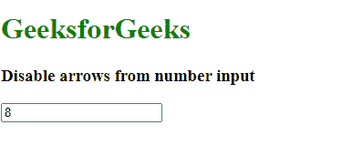

# 如何禁用数字输入的箭头？

> 原文:[https://www . geesforgeks . org/如何禁用-数字输入箭头/](https://www.geeksforgeeks.org/how-to-disable-arrows-from-number-input/)

在本文中，我们将看到如何禁用数字输入中的箭头。

请参见下面的图片，第一张图片有默认箭头，第二张图片没有箭头。



默认输入框(有箭头)



没有箭头的输入框。

为此，我们使用以下语法:

**方法 1:**

**对于 chrome、Safari、Edge、Opera :**

```html
input::-webkit-outer-spin-button,
input::-webkit-inner-spin-button {
    -webkit-appearance: none;
    margin: 0;
}
```

**火狐:**

```html
input[type=number]{
    -moz-appearance: textfield;
}
```

**示例:**

## 超文本标记语言

```html
<!DOCTYPE html>
<html>

<head>
    <style>
        input::-webkit-outer-spin-button,
        input::-webkit-inner-spin-button {
            -webkit-appearance: none;
            margin: 0;
        }

        input[type=number] {
            -moz-appearance: textfield;
        }
    </style>
</head>

<body>
    <h1 style="color: green;">
      GeeksforGeeks
    </h1>

    <h3>
        How to disable arrows from
        Number input using CSS?
    </h3>

    <input type="number" 
           placeholder="Enter number..." />
</body>

</html>
```

**输出:**



**方法 2:** 这种方法简单而强大。使用 **inputmode="numeric"** 属性可以找到一个没有箭头的输入框。较旧的浏览器可能不支持此功能，例如 Internet Explorer 和 Safari，但大多数现代浏览器(如 Chrome、Firefox、Edge、Opera)都支持此属性。该属性的主要目的是在移动设备中提供数字输入界面。

```html
<input type="text" inputmode="numeric" />
```

**示例:**

## 超文本标记语言

```html
<!DOCTYPE html>
<html>

<body>
    <h1 style="color: green;">GeeksforGeeks</h1>

    <h3>
        Disable arrows from number input
    </h3>

  <input type="text" inputmode="numeric"
         placeholder="Enter number..."/>
</body>

</html>
```

**输出:**

