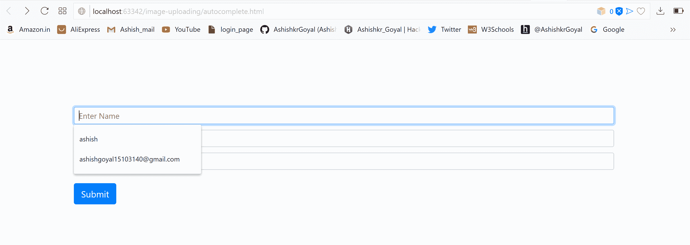
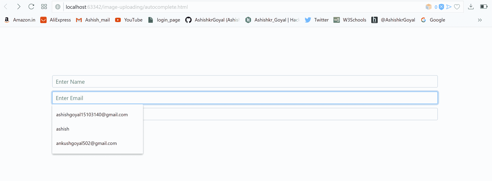
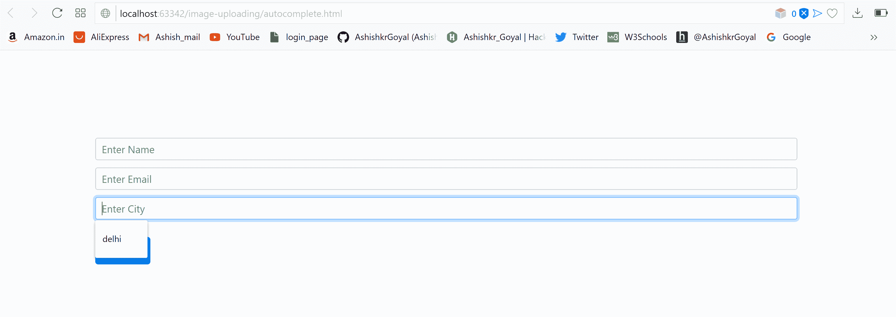
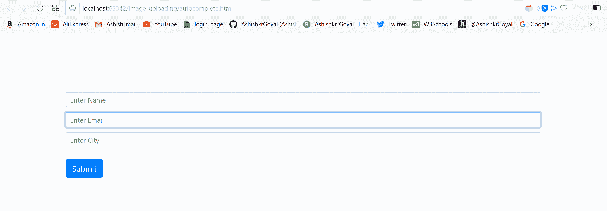
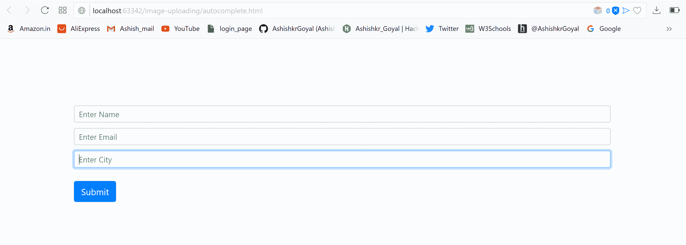

# 如何在 web 表单域/输入标签上禁用浏览器自动完成？

> 原文:[https://www . geesforgeks . org/如何禁用-浏览器-web 表单上的自动完成-字段-输入-标记/](https://www.geeksforgeeks.org/how-to-disable-browser-autocomplete-on-web-form-field-input-tag/)

输入文本自动完成是任何浏览器的默认功能。在处理 HTML 网页中的表单或输入字段时，浏览器的自动完成功能会显示在图片中。默认情况下，浏览器中启用了自动完成功能，因此在提交表单时，它会记住信息。因此，当再次打开相同的表单或填写相同的输入字段时，它会显示用户之前填写的建议。

自动完成属性用于启用和禁用文本的自动完成。该属性包含两个值:

*   在
*   离开

要禁用表单或输入字段中的自动完成功能，请将自动完成属性设置为 off。

**语法:**

```html
autocomplete: on/off
```

**示例:**本示例不使用自动完成属性，因此默认情况下自动完成属性为启用。

```html
<!DOCTYPE html>
<html>

<head>
    <title>
        HTML autocomplete attribute
    </title>

    <style>
        form {
            margin: 10%;
        }
        .form-control {
            margin-top: 10px;
        }
    </style>

    <link href=
"https://stackpath.bootstrapcdn.com/bootstrap/4.3.1/css/bootstrap.min.css" 
    rel="stylesheet" >
</head>

<body>
    <div class="container col-lg-12 form">

    <form action="/submit"
          method="post" 
          enctype="multipart/form-data">
        <div class="form-group">
            <input type="text" 
                   class="form-control form-control-sm"
                id="name" name="username" 
                    placeholder="Enter Name">

            <input type="text" 
                   class="form-control form-control-sm"
                id="email" name="email" 
                placeholder="Enter Email">

            <input type="text" 
                   class="form-control form-control-sm" 
                id="city" name="city" 
                placeholder="Enter City">
            <br>

            <button type="submit" 
                    class="btn btn-primary">
                Submit
            </button>
        </div>
    </form>
    </div>
</body>

</html>                    
```

**输出:**




**注意:**自动完成建议将始终按照之前填写的信息显示在表单上。

**示例 2:** 本示例将自动完成属性设置为关闭。

```html
<!DOCTYPE html>
<html>

<head>
    <title>
        HTML autocomplete attribute
    </title>

    <style>
        form {
            margin: 10%;
        }
        .form-control {
            margin-top: 10px;
        }
    </style>

    <link href=
"https://stackpath.bootstrapcdn.com/bootstrap/4.3.1/css/bootstrap.min.css" 
    rel="stylesheet" >
</head>

<body>
    <div class="container col-lg-12 form">

    <form action="/submit" 
          autocomplete="off"
          method="post"
                enctype="multipart/form-data">
        <div class="form-group">
            <input type="text" 
                   class="form-control form-control-sm"
                id="name" name="username" 
                placeholder="Enter Name">

            <input type="text" 
                   class="form-control form-control-sm"
                id="email" name="email" 
                placeholder="Enter Email">

            <input type="text" 
                   class="form-control form-control-sm" 
                id="city" name="city" 
                placeholder="Enter City">
            <br>

            <button type="submit" class="btn btn-primary">
                Submit
            </button>
        </div>
    </form>
    </div>
</body>

</html>                    
```

**输出:**


