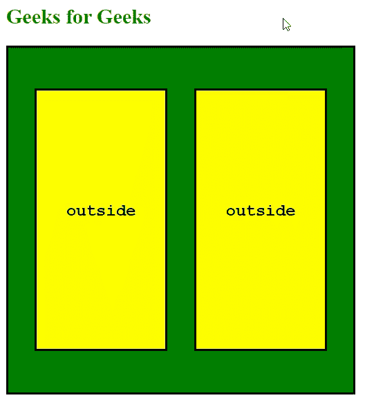

# 如何禁用子元素触发的 mouseout 事件？

> 原文:[https://www . geesforgeks . org/how-disable-mouse out-由子元素触发的事件/](https://www.geeksforgeeks.org/how-to-disable-mouseout-events-triggered-by-child-elements/)

在本文中，我们将讨论如何避免由于事件冒泡而从子元素触发不想要的“mouseout”事件。这个动作可以通过监听以下事件来实现，而不是“悬停”，或者“鼠标悬停”和“鼠标移出”事件:

1.  **onmouseenter:** 当光标/指针移动到元素上时，触发此事件。此事件不会向上传播到父元素，因此可以在消除事件冒泡的情况下使用。
2.  **onmouseleave:** 当光标/指针移出元素时，触发此事件。在“mouseenter”上，此事件不会在层次结构中向上传播文档。

*   **JS 代码:**这个例子是用香草 JavaScript 实现的。

    ## Java Script 语言

    ```htmlhtml
    window.addEventListener('load', ()=>{
        const parent = document.querySelector('.parent');
        const child1 = document.querySelector('.child1');
        const child2 = document.querySelector('.child2');
        const enter = 'Inside';
        const exit = 'Outside';
        parent.addEventListener('mouseenter', ()=>{
            child1.innerText = enter;
            child2.innerText = enter;
        });
        parent.addEventListener('mouseleave', ()=>{
            child1.innerText = exit;
            child2.innerText = exit;
        });  
    });
    ```

    *   **JS 代码:** jQuery 部分实现。

    ## Java Script 语言

    ```htmlhtml
    $('document').ready(()=>{
        $('.parent').on({
            'mouseenter': () =>{

                $('.child1').text('inside');
                $('.child2').text('inside');
            },
            'mouseleave' : () => {
                $('.child1').text('outside');
                $('.child2').text('outside');
            }
        });
    });
    ```

    **最终代码:**

    ## 超文本标记语言

    ```htmlhtml
    <!DOCTYPE html>
    <html lang="en">
    <head>
        <meta charset="UTF-8">
        <meta name="viewport" 
              content="width=device-width, initial-scale=1.0">
        <title>
         Disable mouseout events triggered by child elements
        </title>
        <script src="https://code.jquery.com/jquery-3.5.1.min.js"
    integrity="sha256-9/aliU8dGd2tb6OSsuzixeV4y/faTqgFtohetphbbj0="
        crossorigin="anonymous">
       </script>
    </head>
    <body>
        <h2 style = "color: green;">Geeks for Geeks</h2>
        <div class="parent">
            <div class="child1">Child 1</div>
            <div class="child2">Child 2</div>
        </div>
    </body>
    <style>
        .parent{
            width: 400px;
            height: 400px;
            border: 2px Solid black;
            display: flex;
            align-items: center;
            justify-content: space-evenly;
            background-color: green;
        }
        .parent > div{
            width: 150px;
            height: 300px;
            border: 2px solid black;
            text-align: center;
            line-height: 280px;
            display: inline-block;
            font-family:'Courier New', Courier, monospace;
            font-size: larger;
            font-weight: bolder;
            color: black;
            background-color:yellow;
        }
    </style>
    <script type="text/javascript">
        window.addEventListener('load', ()=>{
            const parent = document.querySelector('.parent');
            const child1 = document.querySelector('.child1');
            const child2 = document.querySelector('.child2');
            const enter = 'Inside';
            const exit = 'Outside';
            parent.addEventListener('mouseenter', ()=>{
                child1.innerText = enter;
                child2.innerText = enter;
            });
            parent.addEventListener('mouseleave', ()=>{
                child1.innerText = exit;
                child2.innerText = exit;
            });

        });
    </script>
    </html>
    ```

    **Output:**
    