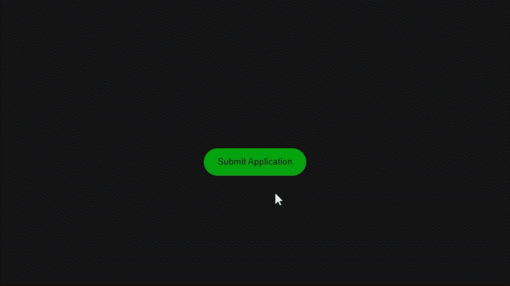

# 如何在页面中显示对话框？

> 原文:[https://www . geesforgeks . org/如何在页面中显示对话框/](https://www.geeksforgeeks.org/how-to-display-a-dialog-box-in-the-page/)

在本文中，我们将看到如何在我们的网页上实现一些特定动作的对话框。这可以通过[jQuery yui](https://www.geeksforgeeks.org/jquery-ui-introduction/)来实现，它是各种样式组件、小部件、效果、主题以及更多可以与 jQuery 一起使用的东西的集合。

**jQueryUI CDN 链接:**在 HTML 文件的[头](https://www.geeksforgeeks.org/html-head-tag/)标签中添加以下链接。

> <链接 rel= "样式表" href = "//code . jquery . com/ui/1 . 13 . 0/themes/base/jquery-ui . CSS ">

**进场:**

*   我们将创建一个按钮并实现一个负责打开对话框的功能。
*   在对话框中，我们将有一个*关闭*按钮和一个*确定*按钮，通过点击其中任何一个按钮将关闭对话框。

**示例:**

## 超文本标记语言

```html
<!DOCTYPE html>
<html lang="en">

<head>
    <!-- jQuery theme for styling dialog box -->
    <link rel="stylesheet" 
          href=
"//code.jquery.com/ui/1.13.0/themes/base/jquery-ui.css" />
    <!-- jQuery CDN link -->
    <script src=
"https://ajax.googleapis.com/ajax/libs/jquery/3.6.0/jquery.min.js">
    </script>
    <!-- jQuery UI link for creating the dialog box -->
    <script src=
"https://code.jquery.com/ui/1.13.0/jquery-ui.js">
    </script>
    <!-- CSS code -->
    <style>
    * {
        margin: 0;
        padding: 0;
    }

    .main {
        height: 100vh;
        background-color: rgb(22, 22, 22);
        display: flex;
        align-items: center;
        justify-content: center;
    }

    button {
        height: 40px;
        width: 150px;
        border-radius: 50px;
        border: none;
        outline: none;
        background-color: rgb(0, 167, 14);
    }

    button:hover {
        background-color: rgb(0, 131, 11);
    }
    </style>
</head>

<body>
    <!-- Content of the dialog box -->
    <div class="main">
        <div id="dialog" title="Basic dialog">

<p>Application Submitted successfully</p>

        </div>
        <button id="btn">Submit Application</button>
    </div>
    <script>

    //   jQuery Code
    $(function() {
        $("#dialog").dialog({
            // autoOpen will prevent the dialog 
            // box for opening automatically
            // on refresing the page.
            autoOpen: false,
            buttons: {
                OK: function() {
                    $(this).dialog("close");
                },
            },
            title: "Application",
        });
        $("#btn").click(function() {
            $("#dialog").dialog("open");
        });
    });
    </script>
</body>

</html>
```

**输出:**

