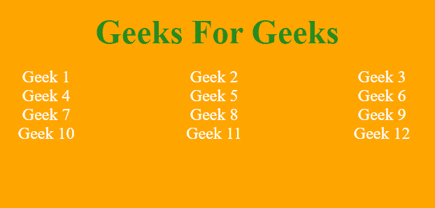
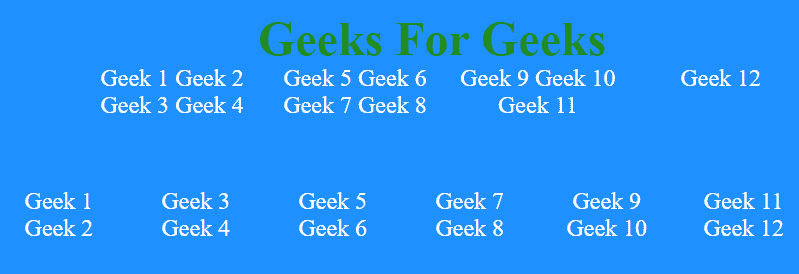

# 如何以 n 列格式显示列表？

> 原文:[https://www . geesforgeks . org/如何显示 n 列列表-格式/](https://www.geeksforgeeks.org/how-to-display-a-list-in-n-columns-format/)

我们可以通过两种方式以 n 列格式显示列表:

1.  [使用列表中的浮动](#no_1)
2.  [使用列表中的列数](#no_2)

**Using float in list:** By using float, we can make list to float left, i.e. the next item which follows it will be displayed into left. So, here we set the size of ol as 30em and size of one list item as 10em thus only 3 items can accommodate in one line and forming three columns. To get the desired number of columns you can set the size of ol and size of one item accordingly.

**例 1:**

```htmlhtml
<!DOCTYPE html>
<html lang="en">

<head>
    <meta charset="utf-8">
    <title>
        How to display a list in
        n columns format?   
    </title>

    <!--CSS Code-->
    <style media="screen">
        body{
            background: orange;
            overflow: hidden;
        }
        h1 {
            text-align: center;
            color: green;
        }
        ol{
            /* As width is 10 so it
            will create 3 columns */
            width: 30em;

            /* Removes any style
               in list */
            list-style: none;
            color: white;
            position: absolute;
        }
        ol li{

            /* Makes the list to
               float left */
            float: left;

            /* Size of one list item */
            width: 10em;
        }
        br {
            clear: left;
        }

        /* Creates gap between
            two two columns */
        div.wrapper {
            margin-bottom: 1em;
        }
    </style>
</head>

<body>
    <!-- HTML Code -->
    <h1>Geeks For Geeks</h1>
    <center>
        <div class="wrapper">
            <ol>
                <li>Geek 1</li>
                <li>Geek 2</li>
                <li>Geek 3</li>
                <li>Geek 4</li>
                <li>Geek 5</li>
                <li>Geek 6</li>
                <li>Geek 7</li>
                <li>Geek 8</li>
                <li>Geek 9</li>
                <li>Geek 10</li>
                <li>Geek 11</li>
                <li>Geek 12</li>
            </ol>
        </div>
    </center>
</body>

</html>
```

**输出:**


**Using column-count in list:** Column-count in CSS helps you to decide the number of columns that you want in your output. Its value can be any positive integer. Here the example with two different values of n ( n = 6, n = 4).

**例 2:**

```htmlhtml
<!DOCTYPE html>
<html lang="en">

<head>
    <meta charset="utf-8">

    <title>
        How to display a list in
        n columns format?
    </title>

    <!--CSS Code-->
    <style media="screen">
        body{
            background: dodgerblue;
            overflow: hidden;
        }

        h1 {
            text-align: center;
            color: green;
        }

        /* Here value of column-count can
           be any positive integer value */
        ol.no_1{

            /* Divides into 4 columns */
            column-count: 4;

            /* Removes any style in list */
            list-style: none;
            height: 300px;

            left:15%;
            color: white;
            position: absolute;
        }
        ol.no_2{

            /* Divides into 6 columns */
            column-count: 6;

            /* Removes any style in list */
            list-style: none;
            height: 300px;
            top:35%;
            left:5%;
            color: white;
            position: absolute;
        }
        ol li{
            /* It is the necessary statement
               as it makes it compactile
               with the height of ol */
            display: inline-block;
        }
    </style>
</head>

<body>
    <!-- HTML Code -->
    <h1>Geeks For Geeks</h1>

    <div class="wrapper">

        <!-- Class with n=4 -->
        <ol class="no_1">
            <li>Geek 1</li>
            <li>Geek 2</li>
            <li>Geek 3</li>
            <li>Geek 4</li>
            <li>Geek 5</li>
            <li>Geek 6</li>
            <li>Geek 7</li>
            <li>Geek 8</li>
            <li>Geek 9</li>
            <li>Geek 10</li>
            <li>Geek 11</li>
            <li>Geek 12</li>
        </ol>

        <!-- Class with n=6 -->
        <ol class="no_2">
            <li>Geek 1</li>
            <li>Geek 2</li>
            <li>Geek 3</li>
            <li>Geek 4</li>
            <li>Geek 5</li>
            <li>Geek 6</li>
            <li>Geek 7</li>
            <li>Geek 8</li>
            <li>Geek 9</li>
            <li>Geek 10</li>
            <li>Geek 11</li>
            <li>Geek 12</li>
        </ol>
    </div>
</body>

</html>
```

**输出:**
