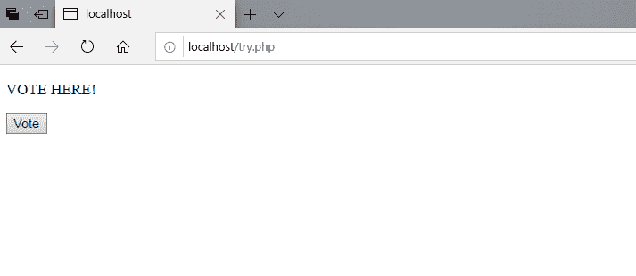
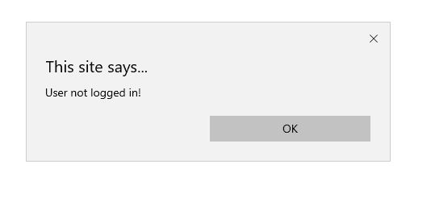

# 当注销用户尝试投票时，如何显示弹出消息？

> 原文:[https://www . geesforgeks . org/如何显示-弹出消息-何时注销-用户-尝试投票/](https://www.geeksforgeeks.org/how-to-display-popup-message-when-logged-out-user-try-to-vote/)

**如何检测用户登录或注销？**
当用户满足登录条件时，其状态变为已登录。为了让网站或系统了解用户登录，通常会在用户登录后立即设置 **$_SESSION[' ']** 变量。该变量设置后有助于网站识别用户的存在，并提供对所有可用功能的访问。

例如，当我们登录一个网站时，它通常会显示如下消息:

```htmlhtml
WELCOME Name_Of_The_user
```

**那么这是怎么发生的呢？**
当用户登录一个网站时，该网站会识别该用户，并从数据库中提取关于该用户的必要信息，以便正常运行。同时 **$_SESSION[' ']** 变量被设置为帮助网站上的每个页面知道用户正在会话或登录。

因此，如果用户没有登录，则不会设置 **$_SESSION[' ']** 变量。要在用户注销时显示弹出消息，我们只需运行 if 循环。当用户点击一个按钮时，将它们指向一个 PHP 文件或同一文件中的一个函数，该函数检查用户是否登录。

**示例:**当 PHP 函数存在于同一个文件内部时。

考虑 HTML 文件中的以下代码:

```htmlhtml
<!DOCTYPE html>
<html>

<head>
    <title>
        How to display popup message 
        when logged out user try to 
        vote?
    </title>
</head>

<body>
    <form method="POST" action="">
        <p> VOTE HERE! </p>
        <button type="submit">Vote </button>
    </form>

    <?php
        if(!isset($_SESSION[''])) {
            echo " <script type='text/javascript'>";
            echo "alert('User not logged in!')";
            echo " </script>"; 
        }
    ?>
</body>

</html>
```

**输出:**

*   **点击投票按钮前:**
    
*   **点击投票按钮后:**
    

**示例:**当 PHP 函数存在于另一个文件中时。

考虑 HTML 文件中的以下代码:

```htmlhtml
<!DOCTYPE html>
<html>

<head>
    <title>
        How to display popup message 
        when logged out user try to 
        vote?
    </title>
</head>

<body>
    <form method="POST" action="check.php">
        <p> VOTE HERE! </p>
        <button type="submit">Vote </button>
    </form>
</body>

</html>
```

考虑**check.php**文件中的以下代码:

```htmlhtml
<?php
    if(!isset($_SESSION[''])) {
      echo "<script type='text/javascript'>";
      echo "alert('User not logged in!')";
      echo "</script>"; 
    }
?>
```

**输出:**

*   **点击投票按钮前:**
    
*   **点击投票按钮后:**
    