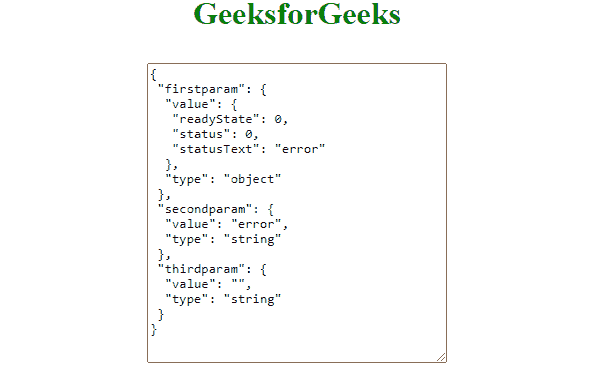

# Ajax 中如何做异常处理？

> 原文:[https://www . geesforgeks . org/how-do-异常处理-in-ajax/](https://www.geeksforgeeks.org/how-to-do-exception-handling-in-ajax/)

本文的目的是演示我们如何处理 [jQuery AJAX](https://www.geeksforgeeks.org/jquery-ajax-method/) 请求中的异常。需要对 [HTML](https://www.geeksforgeeks.org/html-tutorials/) 、 [CSS](https://www.geeksforgeeks.org/css-tutorials/) 、 [jQuery](https://www.geeksforgeeks.org/jquery-tutorials/) 有基本的了解。这可以通过 AJAX [**fail()**](https://www.geeksforgeeks.org/jquery-deferred-fail-method/) 方法来实现。我们讨论了 3 种 AJAX 方法，以更好地理解从我们的网络浏览器向特定服务器发出任何 [ajax()](https://www.geeksforgeeks.org/jquery-ajax-method/) 请求时会发生什么。

[**AJAX**](https://www.geeksforgeeks.org/ajax-introduction/)**:**AJAX 是“异步 JavaScript 和 XML”的缩写。Ajax 组件利用 JavaScript 的这种能力来发送异步 HTTP 请求，接收 XML 响应(以及其他格式)，并更新网站的一部分(使用 JavaScript)，而无需重新加载或刷新整个网站。

我们需要知道的发出 AJAX 请求的三种方法如下。

当 HTTP 请求成功时，会调用此方法。

```
$.ajax(options).done(callback)
```

当 HTTP 请求失败时，会调用此方法。

```
$.ajax(options).fail(callback)
```

无论 HTTP 请求失败还是成功，都会调用此方法。

```
$.ajax(options).always(callback)
```

**示例:**我们将看到如何使用 AJAX [**fail()**](https://www.geeksforgeeks.org/jquery-deferred-fail-method/) 方法来处理 HTTP 请求中的错误。 **fail()** 回调取 3 个参数，其中第一个参数是 [JSON](https://www.geeksforgeeks.org/javascript-json-objects/) 错误对象，第二个参数以文本格式给出原因，最后一个参数是 HTTP 请求抛出的错误。具有不同参数值的整个对象显示在文本区域中。输出以 JSON 格式显示，向您显示当 HTTP 请求失败时作为参数接收的值的值和类型。

输出的格式如下。

```
"firstparam": {
    value: -> the value of the first parameter
    type:  -> the type of the first parameter
},
"secondparam": {
    value: -> value of second parameter
    type:  -> the type of the second parameter
},
" thirdparam": {
    value: -> value of third parameter
    type:  -> the type of the third parameter
}
```

**示例:**

## 超文本标记语言

```
<!DOCTYPE html>
<html>

<head>
    <script type="text/javascript" src=
"https://cdnjs.cloudflare.com/ajax/libs/jquery/3.6.0/jquery.min.js">
    </script>

    <style>
        .container {
            display: flex;
            justify-content: center;
        }

        h1 {
            color: green;
        }

        textarea {
            margin-top: 10px;
            width: 300px;
            height: 300px;
        }
    </style>

    <script type="text/javascript">
        $(document).ready(function () {

            var obj = "";
            $.ajax("gfg.txt").done(function () {
                alert("success");
            }).fail(function (errorobj, textstatus, error) {
                obj = JSON.stringify({
                    firstparam: {
                        value: errorobj,
                        type: typeof (errorobj)
                    },
                    secondparam: {
                        value: textstatus,
                        type: typeof (textstatus)
                    },
                    thirdparam: {
                        value: error,
                        type: typeof (error)
                    }
                }, undefined, 1);
            }).always(function () {
                $('textarea').val(obj);
            });
        });
    </script>
</head>

<body>
    <h1 class="container">
        GeeksforGeeks
    </h1>
    <div class="container">
        <textarea></textarea>
    </div>
</body>

</html>
```

**输出:**

