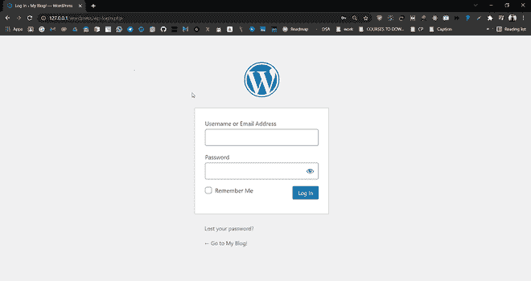
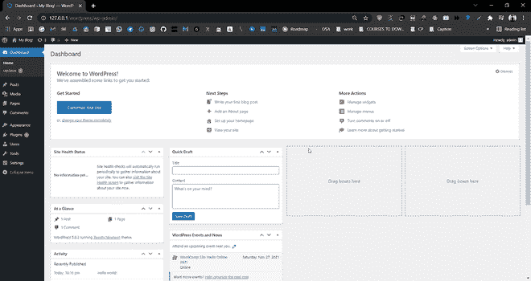
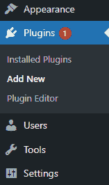
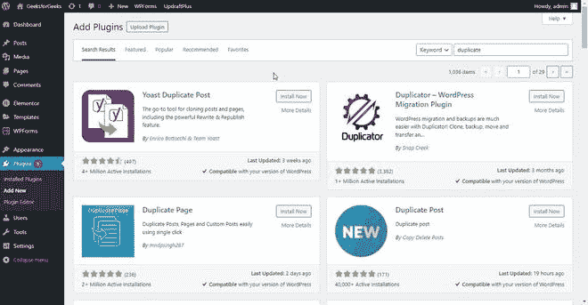
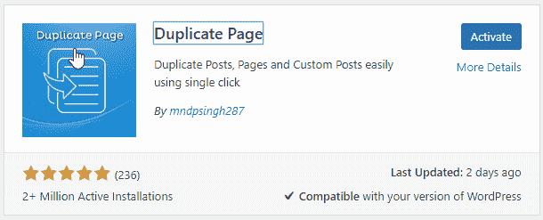
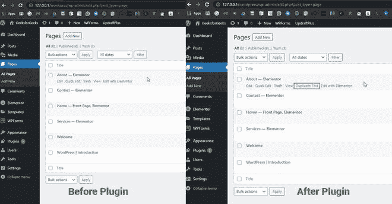

# 如何一键复制 WordPress 页面或发帖？

> 原文:[https://www . geesforgeks . org/如何一键复制 WordPress-page-or-post/](https://www.geeksforgeeks.org/how-to-duplicate-wordpress-page-or-post-with-a-single-click/)

在本文中，我们将讨论如何通过单击复制一个 WordPress 页面或文章。在继续这个话题之前，我们应该知道什么是 WordPress！[**<u>WordPress</u>**](https://www.geeksforgeeks.org/wordpress/)是一个免费开源的内容管理系统(CMS)框架。它是最近使用最广泛的内容管理系统框架。

在 WordPress 中，我们可以创建几乎所有类型的网站，如单页、多页、电子商务、代理等。我们可能需要为不同的产品使用相同的页面或帖子，这些产品都有相同的主题和设置，但内容不同。假设我们正在创建一个电子商务网站，我们想要列出数百甚至数千种产品，那么从头开始创建每种产品的页面，并为每种产品更改相同的设置并不是一个好的选择。相反，我们可以创建该页面或帖子的副本，并相应地更改其内容和图像。

不幸的是，默认情况下，WordPress 没有给我们提供这样一个选项，我们可以创建一个重复的页面或帖子，但是我们有这么多插件，我们可以安装到你的 WordPress 并实现同样的效果。我们将看到如何创建一个重复的网页，只需点击一下就可以发布的步骤。

**第一步。**进入 WordPress 登录面板，输入用户名和密码登录 WordPress 仪表盘。您可以通过在网站网址的末尾添加/登录来访问登录面板。

WordPress 登录面板

登录后，您将看到类似如下的仪表板:

WordPress 仪表板

**第二步。**在左侧，你会看到很多选项。转到**插件>T5【新增】。**

**第三步。**你会在那里找到一个搜索选项，用关键词“重复”搜索。你会看到有很多选择，在这篇文章中，我们将使用一个名为**的插件来复制 mndsingh287 的页面**。

**第四步。**点击【立即安装】安装**复制页面**插件，然后点击**激活。**

成功安装并激活复制页面插件后，您就可以创建您想要的任何页面或帖子的副本了。只需从 **Pages > > All Pages** 或**Post>>All Post**转到页面部分，悬停在页面或帖子上，你会发现一个选项**“复制这个”**点击它，一切就完成了！

