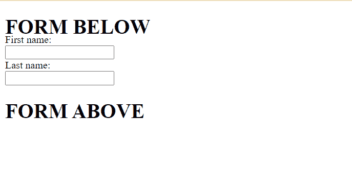

# 如何消除一个

前后的多余空间

<form>tag ?

> 原文:[https://www . geeksforgeeks . org/如何消除表单标签前后的额外空间/](https://www.geeksforgeeks.org/how-to-eliminate-extra-space-before-and-after-a-form-tag/)

在本文中，我们将学习如何消除 HTML 中表单标签后的额外空间。

**方法 1:** 我们可以通过简单地使用**边距-底部**属性来移除任意两个标签之间的空间。margin-bottom 属性设置元素的底部边距。我们将为特定标签的页边空白分配一个负值，以消除标签之间的额外空间，如图所示。

下面的例子将演示这种方法。

**示例:**在本例中，我们将通过将第一个标题标签的*边距-底部*设置为 *-8px 来删除第一个标题标签和表单之间的额外空间。*

## 超文本标记语言

```htmlhtml
<!DOCTYPE html>
<html lang="en">

<body>
    <h1 style="margin-bottom: -8px;">
        FORM BELOW
    </h1>
    <form>
        <label for="fname">
            First name:
        </label>
        <br>
        <input type="text" id="fname" name="fname">
        <br>
        <label for="lname">
            Last name:
        </label>
        <br>
        <input type="text" id="lname" name="lname">
    </form>
    <h1>FORM ABOVE</h1>
</body>

</html>
```

**输出:**



**方法 2:** 我们也可以使用**页边距-顶部**属性来消除多余的空间。上边距属性设置元素的上边距。当我们使用页边距顶部时，我们必须将它应用到标签上，这样我们就必须消除它上面的额外空间。这个例子演示了这种方法。

**示例:**在本例中，我们将通过将表单标签的*页边距-顶部*设置为 *-8px* 来删除表单和第二个标题标签之间的额外空间。

## 超文本标记语言

```htmlhtml
<!DOCTYPE html>
<html lang="en">

<body>
    <h1>FORM BELOW</h1>
    <form>
        <label for="fname">
            First name:
        </label><br>
        <input type="text" id="fname" name="fname">
        <br>
        <label for="lname">
            Last name:</label><br>
        <input type="text" id="lname" name="lname">
    </form>
    <h1 style="margin-top: -8px;">
        FORM ABOVE
    </h1>
</body>

</html>
```

**输出:**


</form>