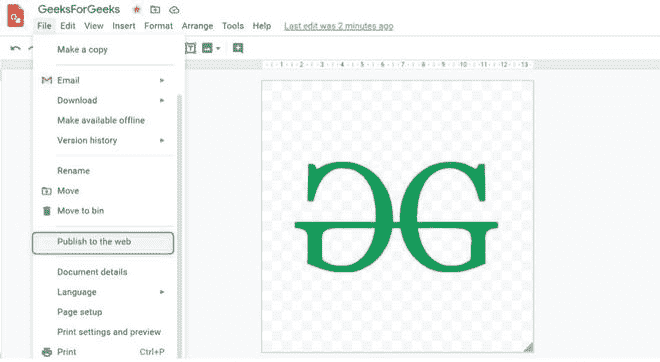
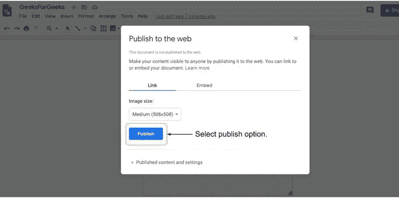
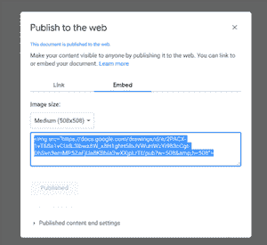
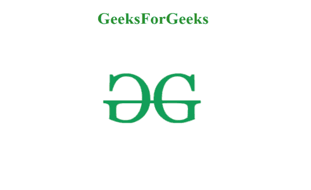

# 如何在网站上嵌入谷歌绘图？

> 原文:[https://www . geeksforgeeks . org/如何嵌入-谷歌-网站绘图/](https://www.geeksforgeeks.org/how-to-embed-google-drawing-on-the-website/)

谷歌绘图是一个惊人的平台，可以创建良好的插图，然后随心所欲地使用它们。该平台由谷歌支持，完全可以自由使用、创建和编辑图像。因为你正在制作自己的图片，所以你可以避免在你的网站上抄袭的问题。

**网站:**[https://docs . Google . com/drawings/d/19 ssyfdmpudd2tfj 0 wickwastad 91 h6i 9 jvlii9 vw4/编辑](https://docs.google.com/drawings/d/19SSYFdMPUDPdVD2tFj0wICwasTAD91H6i9jVlii9Vw4/edit)

要嵌入任何图像，你必须制作一个。创建一个后，请遵循下面提到的步骤:

1.从导航菜单的**文件**中选择**发布到网络**选项。



2.现在发布它并转到嵌入选项。



3.



**示例:**

## 超文本标记语言

```html
<!DOCTYPE html>
<html>

<head>
    <title>Geeks For Geeks</title>
    <style>
        body {
            color: forestgreen;
        }
    </style>
</head>

<body>
    <center>
        <h1>GeeksForGeeks</h1>
        <!-- Embedding image from google drawing -->
        
    </center>
</body>

</html>
```

**输出:**



输出屏幕将如下所示