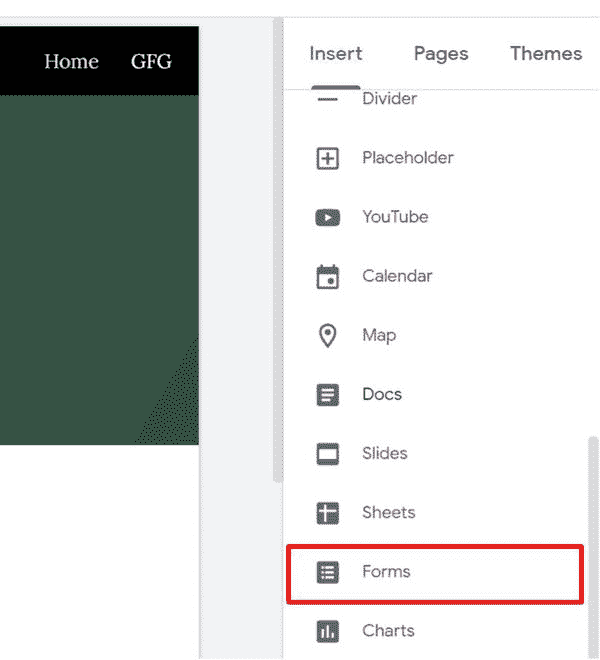
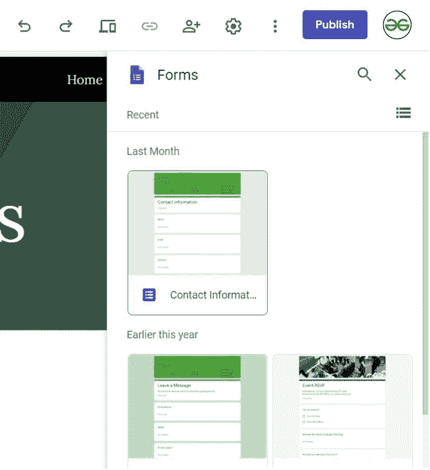
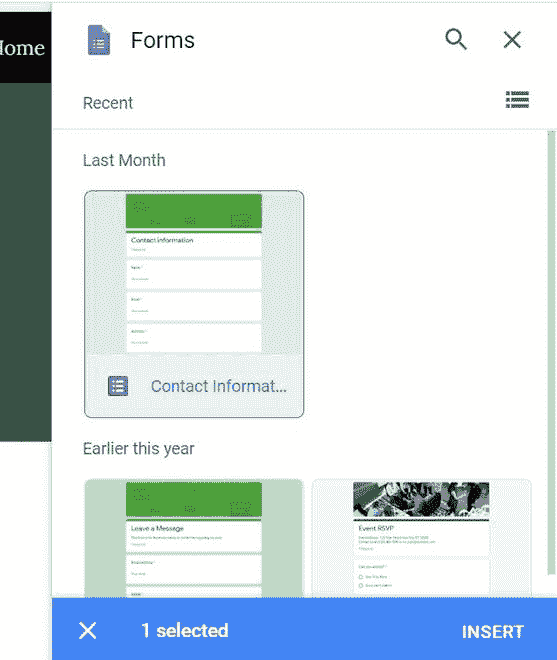
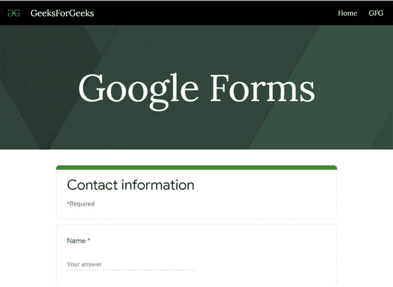

# 如何在新的谷歌网站中嵌入谷歌表单？

> 原文:[https://www . geeksforgeeks . org/如何嵌入新谷歌表单-谷歌网站/](https://www.geeksforgeeks.org/how-to-embed-google-forms-in-new-google-sites/)

谷歌表单是谷歌开发和支持的最著名的在线平台之一。用户可以创建和自定义创建的表单，并可以执行从审查到自动证书生成器的各种任务。人们还可以将它嵌入网站，这样任何访问该网站的人都可以提交或查看表单。本文将描述在新的谷歌网站中嵌入谷歌表单的方法。

*   转到插入面板并向下滚动以选择表单选项。

*   之后，网站平台会搜索你的硬盘，显示你保存的所有表格，供你选择。

*   选择您要插入的表单，点击*插入按钮*将表单插入您的网站页面。您也可以一次选择多个表单。

*   根据您的需要调整分区大小。插入表单后，网站将如下所示。

