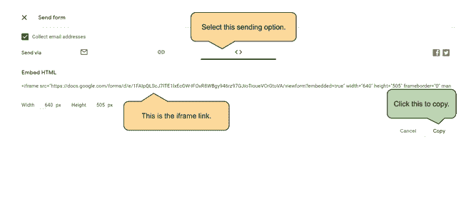
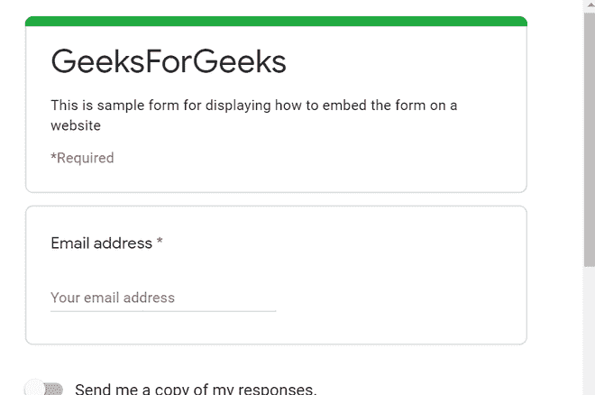

# 如何在任何网站嵌入谷歌表单？

> 原文:[https://www . geeksforgeeks . org/如何在任何网站上嵌入谷歌表单/](https://www.geeksforgeeks.org/how-to-embed-google-forms-on-any-website/)

谷歌表单是谷歌开发和支持的最著名的在线平台之一。用户可以创建和自定义创建的表单，并可以执行从审查到自动证书生成器的各种任务。人们还可以将它嵌入网站，这样任何访问该网站的人都可以提交或查看表单。本文将描述将谷歌表单嵌入任何网站的方法。

**步骤 1:** 创建一个必须嵌入的谷歌表单。[如何创建和定制谷歌表单？](https://www.geeksforgeeks.org/how-to-create-and-customize-google-forms/)文章有按照要求创建和定制谷歌表单所需的步骤。

**第二步:**表单创建完成后，点击发送按钮，如下图所示。


**步骤 3:** 从可用的发送选项中选择嵌入选项。这将显示一个必须复制的< iframe >链接。



**第三步:**在需要嵌入表单的页面的 HTML 源代码中添加这个< iframe >链接。这将自动显示表单，并允许在页面上填写表单。下面的例子说明了如何嵌入表单。

**示例:**

## 超文本标记语言

```html
<!DOCTYPE html>
<html>

<body>
    <h1 style="color: green;">
        GeeksforGeeks
    </h1>

    <p>
        How to embed Google Forms 
        on any website?
    </p>

    <!-- Specify the <iframe> given by the
        the Google Forms embed page -->
    <iframe src="Your Copied Form Source" 
        width="550" height="600" 
        frameborder="0" marginheight="0"
        marginwidth="0">
        Loading…
    </iframe>
</body>

</html>
```

**输出:**



输出屏幕将如下所示