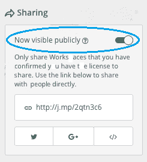
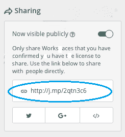
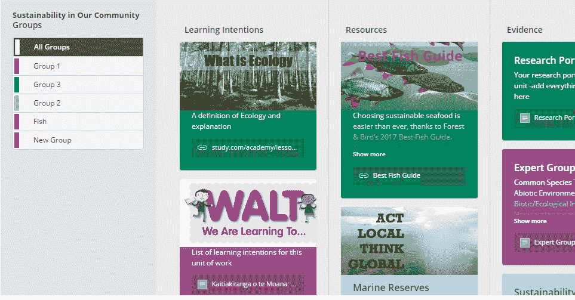

# 如何在新的谷歌网站中嵌入 Hapara Workshop？

> 原文:[https://www . geesforgeks . org/how-embed-hapara-workshop-in-new-Google-sites/](https://www.geeksforgeeks.org/how-to-embed-hapara-workshop-in-new-google-sites/)

**Hapara workspace** 是老师之间协作的平台，老师可以在这里为学生创造个性化的教学体验，分享自己的工作。

Hapara workspace 提供学习对象、任务和多种评估的集合。教师可以与全球和平台上的多名教师分享他们的工作。学生不同于老师，他们可以在项目等方面相互合作。

教师可以构建项目、作业，并轻松地将它们分发给小组。仪表板还提供了访问谷歌教室、谷歌驱动等 Hapara 工作空间的途径

**哈帕拉工作区提供–**

*   教师拥有以学习者为中心的教学法所需的工具，
*   对自己的学习有很大自主权的学习者。

**官方链接:**[https://mystudentdashboard.com/#/login](https://mystudentdashboard.com/#/login)

**要在新的谷歌网站中嵌入 hapara 工作区，请执行以下步骤:**

*   转到已发布的哈帕拉工作区
*   向下滚动到“共享”并打开“公开可见”

*   复制经过给定的链接

*   转到你的谷歌网站，点击插入，然后点击嵌入网址，复制粘贴链接
*   您可以在此选择页面视图类型
    *   访问量
    *   链接视图
*   一旦选择了视图，就嵌入了 hapara 车间

### 输出

