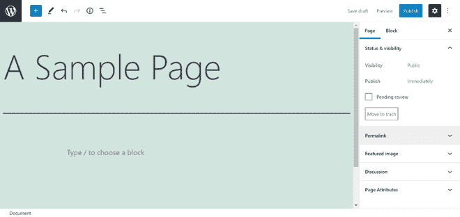
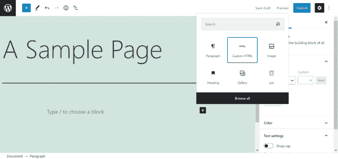
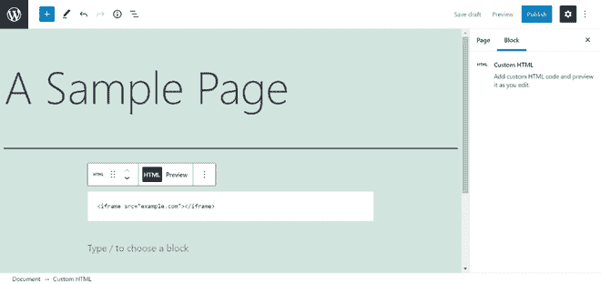

# 如何在 WordPress 中嵌入 iFrame？

> 原文:[https://www . geesforgeks . org/how-embed-iframe-in-WordPress/](https://www.geeksforgeeks.org/how-to-embed-iframe-in-wordpress/)

一个 [Iframe](https://www.geeksforgeeks.org/html-iframes/) 是一种将一个网页嵌入到另一个网页的内容中的方法。这是通过使用 [HTML 元素](https://www.geeksforgeeks.org/html-elements/)、外部网站的网址以及窗口在您的网站上的外观参数来实现的。

**如何在 WordPress 中使用 Iframe:**构建 Iframe 有几种方法，就像有许多情况下您希望使用 Iframe 一样。我们将通过一种最常见的方式将 Iframe 添加到您的 [WordPress](https://www.geeksforgeeks.org/introduction-wordpress/) 网站。

**手动添加 iFrames 到 WordPress 页面:**

向页面添加一个 [Iframe](https://www.geeksforgeeks.org/html-iframes/) 只需要一行代码。需要打开和关闭 HTML 元素，以及网页的 URL。

**语法:**

```html
<iframe src="example.com"></iframe>
```

**嵌入 WordPress 页面的步骤:**

**步骤 1:** 转到希望 iframe 出现的页面。



**第 2 步:**点击添加(+)块按钮，从弹出菜单中选择 HTML。



**第三步:**在编辑器中为要嵌入的页面插入 Iframe 标签。



**注**:来源网址有几个限制需要注意。首先，Iframes 可能只显示来自与您使用相同超文本传输协议(HTTP)的网站的内容。换句话说，如果你的网站是 HTTPS，你只能嵌入来自其他 HTTPS 网站的信息。同样，如果您使用 HTTP，您可能只包括使用 HTTP 的网址。

**第四步:**保存进度并发布页面，点击“发布”按钮。


**第五步。**您的页面现在应该看起来像下面的屏幕。


**关于 Iframe 标签的更多信息:**

如果你能够采用这种策略，请记住，你也可以改变你的 Iframes 来适应你的网站的需求。Iframe 参数开始发挥作用。以下是一些最常见的例子。

*   **允许**:使用该参数，您可以指定您的 Iframe 是否应该具有某些默认行为或功能。
*   **高度**:高度参数设置网页上 Iframe 窗口的像素大小。
*   **宽度**:该选项允许您选择 Iframe 的像素宽度。

例如，窗口大小为 1080 像素乘 720 像素、启用全屏查看并设置为在网页其余部分后下载的 Iframe 如下。

> <iframe src="”https://example.com”" width="”1080″" height="”720″" allow="”fullscreen”"></iframe>

**总结:**保持网站平稳运行，同时还能保持在法律的正确一边，这一点至关重要。Iframes 不仅允许你合乎道德地分享他人的资料，还允许你展示视频和音频文件，而不必将它们存储在自己的网站上。