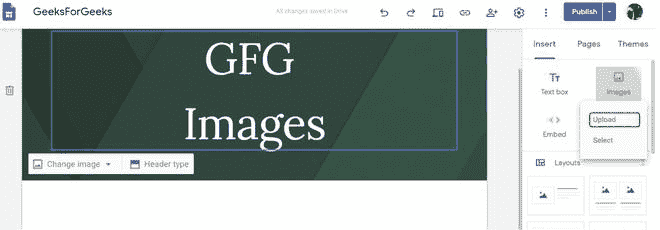
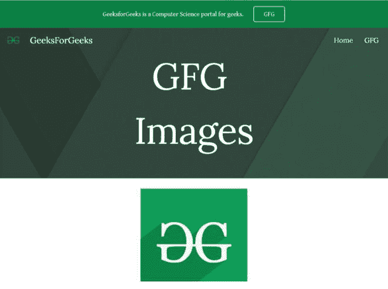
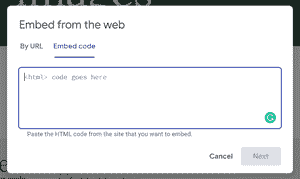

# 如何在谷歌新网站嵌入图片？

> 原文:[https://www . geeksforgeeks . org/如何在新的谷歌网站中嵌入图像/](https://www.geeksforgeeks.org/how-to-embed-images-in-new-google-sites/)


**简介:**图片在一个发展良好的网站中非常重要，因为它们有助于展示一些即使是文字也无法表达的东西。在谷歌网站中插入图片有两种方法:

1.  通过上传
2.  使用 iframes 插入它

如果使用第一种方法插入，您可以编辑的内容不多，但是如果使用第二种方法，您可以设置图像的大小，为其添加边框，甚至创建可点击的图像。

**方法 1:**

*   首先，单击插入面板中的图像选项。它会要求您上传或选择选择上传。



*   之后，只要选择你想上传的图片，你的图片就会被上传。

现在在这张图片上，你可以插入一个链接，添加替代或标题文本，甚至调整它的大小。



**方法二:**从插入面板中选择**嵌入**选项，然后转到出现对话框的**嵌入代码**部分。



在提供的空白处写下你的代码。

*   要插入简单的图像，只需添加以下代码:

```html


```


*   要增加图像的高度和宽度，只需添加以下代码:

```html


```


*   要添加边框样式，只需添加以下代码:

```html


```

有九种不同样式的边框可供选择，它们是:实心、双面、凹槽、虚线、虚线、插图、开头、脊形、隐藏。

