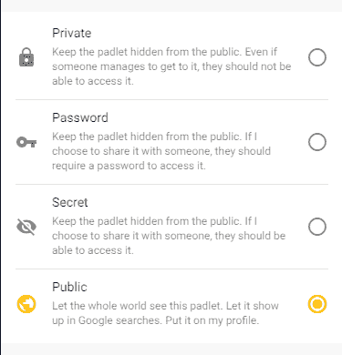
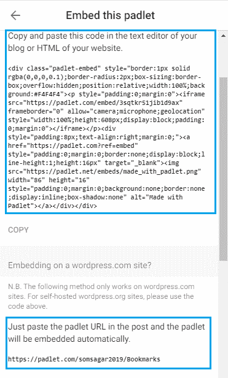

# 如何在新的谷歌网站中嵌入 Padlet？

> 原文:[https://www . geesforgeks . org/how-embed-padlet-in-new-Google-sites/](https://www.geeksforgeeks.org/how-to-embed-padlet-in-new-google-sites/)

**简介:**

小键盘帮助用户在数字世界中张贴笔记。有时在小组项目中，组长必须分配工作或显示时间表，所有这些都可以通过小键盘来实现。要嵌入挂板，你必须先创建一个。

**官方链接:**[https://padlet.com/](https://padlet.com/)

**按照下面提到的步骤在你的谷歌网页中嵌入一个小键盘:**

*   前往[https://padlet.com/](https://padlet.com/)
*   在创建你的小键盘之后。
*   在右上角点击共享。

*   确保隐私小键盘是公开的，这样每个人都可以看到。

*   点击嵌入你的博客或网站选项。
*   这里有两个选项可以嵌入您的小键盘–
    *   完全嵌入的 HTML 代码:在博客的文本编辑器或网站的 HTML 中复制并粘贴这些代码。
    *   这个代码用于嵌入到一个 WordPress 网站中。

*   粘贴此代码后，小键盘将被嵌入。