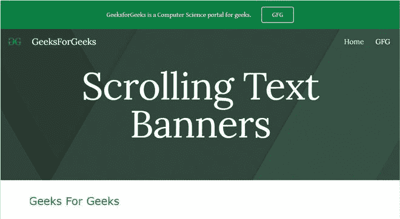

# 如何在新的谷歌网站中嵌入滚动文本横幅？

> 原文:[https://www . geesforgeks . org/如何嵌入-滚动-文本-横幅-新-谷歌-网站/](https://www.geeksforgeeks.org/how-to-embed-scrolling-text-banners-in-new-google-sites/)


在本文中，我们将使用字幕标签。要了解更多关于此标签的信息，请阅读本文[](https://www.geeksforgeeks.org/html-marquee-tag/#:~:text=HTML%20%7C%20tag,-Last%20Updated%3A%2019&text=The%20tag%20in%20HTML,marquee%20element%20comes%20in%20pairs.)**。**

**要在谷歌网站中添加滚动文本横幅，请从插入面板中选择**嵌入**选项，然后转到出现的对话框的**嵌入代码**部分。**

****

**在提供的空白处写下你的代码。要添加简单的横幅，请使用以下代码:**

## **超文本标记语言**

```
<html>

<body>
    <marquee font style="bold" scrolldelay="100">
        <font size="5" face="Verdana">
            <font color="ForestGreen">Geeks For Geeks
    </marquee>
</body>

</html>
```

****

**现在你也可以设置边框，或者改变方向，或者在 HTML 代码中用简单的修改来运行带有文本的图像，尤其是在字幕标签中。**