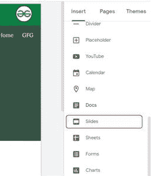
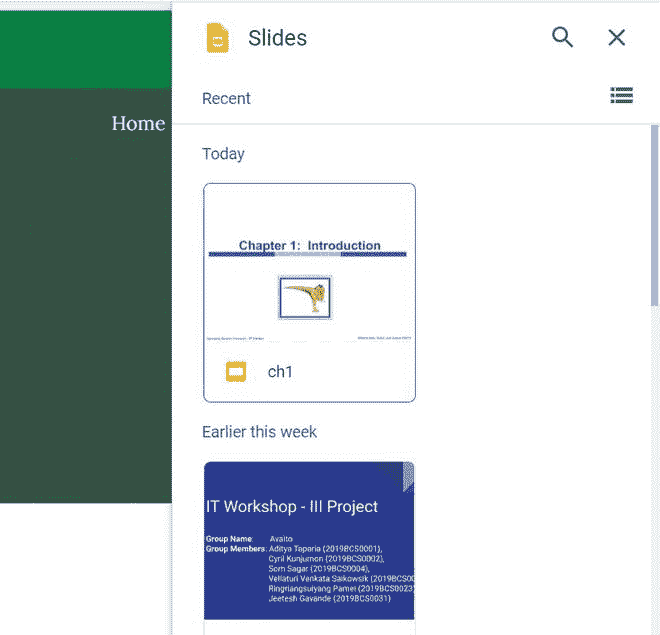
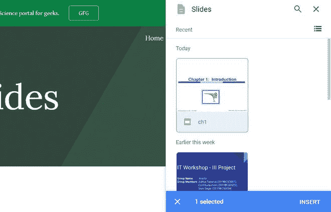
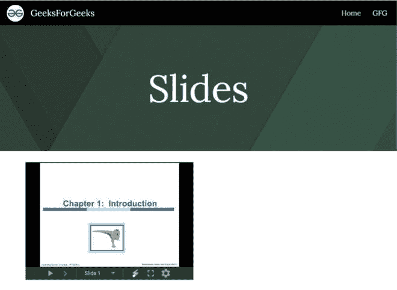
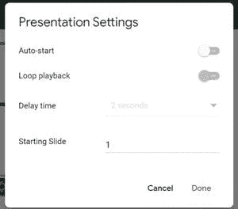

# 如何在谷歌新网站嵌入幻灯片？

> 原文:[https://www . geesforgeks . org/如何在新的谷歌网站中嵌入幻灯片/](https://www.geeksforgeeks.org/how-to-embed-slides-in-new-google-sites/)

有时你想通过你的网站分享一些幻灯片，那么这可能是你在谷歌网站上寻找的东西，你可以在你的网站上嵌入谷歌幻灯片。这是一个非常有用的功能，就好像你有一个教育网站，这样你就可以通过幻灯片向你的同学分享笔记。要将谷歌幻灯片嵌入您的网站，请执行以下步骤:

*   转到页面右侧的插入面板，选择幻灯片选项。

*   选择要嵌入网站的幻灯片。

这是直接链接到你的谷歌驱动器帐户，它搜索了你驱动器中的所有幻灯片供选择。选择幻灯片后，它将自动嵌入您的网站。

*   调整嵌入幻灯片的大小，并设置想要使用的设置。设置所需设置后，网站将如下所示。

**设置:**可用设置如下:

1.  **自动开始:**这允许您自动开始幻灯片演示。
2.  **循环播放:**这将幻灯片演示设置为循环播放。
3.  **延迟时间:**定义每张幻灯片屏幕之间的延迟时间。
4.  **开始幻灯片:**这定义了开始演示的幻灯片编号。

