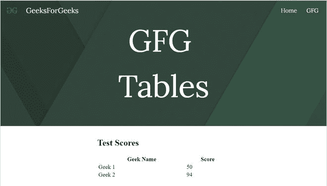
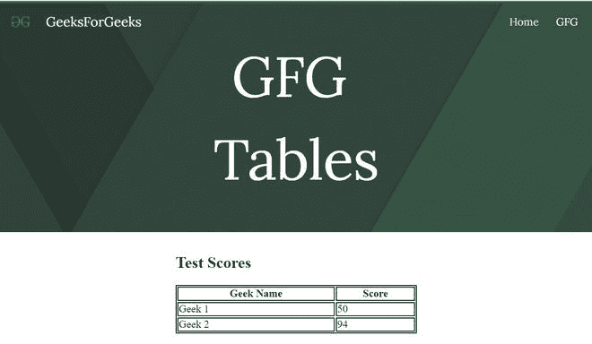
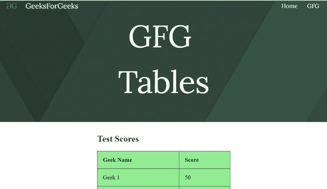

# 如何在谷歌新网站中嵌入表格？

> 原文:[https://www . geesforgeks . org/如何在新谷歌网站中嵌入表格/](https://www.geeksforgeeks.org/how-to-embed-tables-in-new-google-sites/)


有时，我们必须以系统的方式显示一些数据，为此我们使用表格。要将表格嵌入谷歌网站，请执行以下步骤:

从“插入”面板中选择“嵌入”选项，然后转到出现的对话框的“嵌入代码部分”。


在提供的空白处写下你的 iframe 代码。

*   要插入无边框表格，请使用以下代码:

## 超文本标记语言

```html
<body>
    <h2>Test Scores</h2>
    <table style="width:100%">
        <tr>
            <th>Geek Name</th>
            <th>Score</th>
        </tr>
        <tr>
            <td>Geek 1</td>
            <td>50</td>
        </tr>
        <tr>
            <td>Geek 2</td>

            <td>94</td>
        </tr>

    </table>
</body>
```



*   要添加带边框的表格，只需使用以下代码:

## 超文本标记语言

```html
<head>
    <style>
        table,
        th,
        td {
            border: 1px solid black;
        }
    </style>
</head>

<body>
    <h2>Test Scores</h2>
    <table style="width:100%">
        <tr>
            <th>Geek Name</th>
            <th>Score</th>
        </tr>
        <tr>
            <td>Geek 1</td>
            <td>50</td>
        </tr>
        <tr>
            <td>Geek 2</td>
            <td>94</td>
        </tr>
    </table>
</body>
```



*   要添加带有某种背景颜色的表格，请使用以下代码:

## 超文本标记语言

```html
<head>
    <style>
        table,
        th,
        td {
            border: 1px solid black;
            border-collapse: collapse;
        }

        th,
        td {
            padding: 15px;
            text-align: left;
            background-color: lightGreen;
        }
    </style>
</head>

<body>
    <h2>Test Scores</h2>
    <table style="width:100%">
        <tr>
            <th>Geek Name</th>
            <th>Score</th>
        </tr>
        <tr>
            <td>Geek 1</td>
            <td>50</td>
        </tr>
        <tr>
            <td>Geek 2</td>
            <td>94</td>
        </tr>
    </table>
</body>
```



您可以根据自己的要求更改表格的样式和内容。