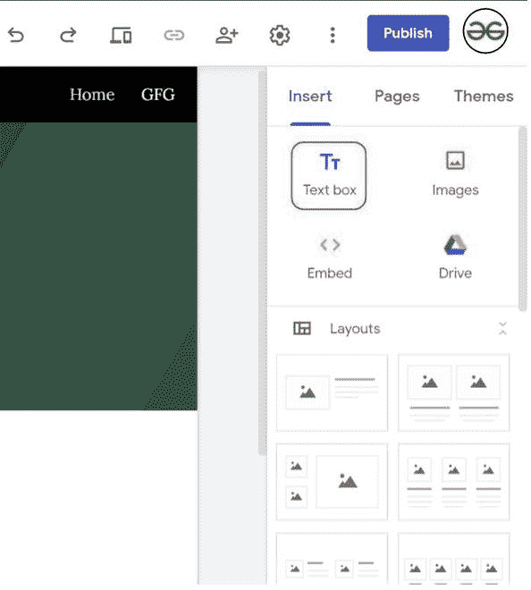
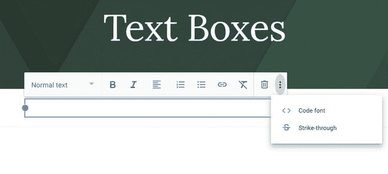
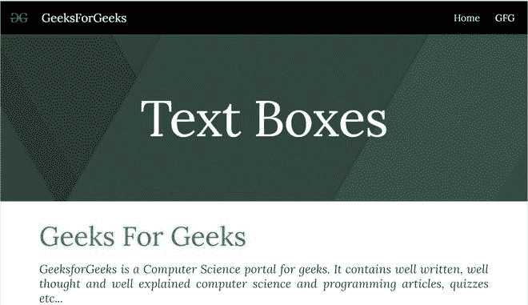

# 如何在谷歌新网站中嵌入文字和文本框？

> 原文:[https://www . geesforgeks . org/如何在新的谷歌网站中嵌入文本和文本框/](https://www.geeksforgeeks.org/how-to-embed-text-and-text-boxes-in-new-google-sites/)

添加文本并赋予它们风格是打造一个好网站最重要的事情。文字是网站的脸面，好的内容展示了网站的丰富性。要添加文本并在谷歌网站中编辑它们，请遵循以下步骤:

*   转到编辑页面右侧的“插入”面板，选择“文本框”选项以插入文本框。

*   当您点击该选项时，页面上会出现一个框，您可以在其中添加内容并编辑其外观。

**特征:**

1.  您可以根据需要将文本样式设置为标题、标题、副标题、小文本和普通文本。
2.  您可以在分割线中的任意位置为文本设置粗体和斜体字体样式。
3.  您也可以将文字对齐为左对齐、中对齐、右对齐和对齐。
4.  您还可以根据需要设置有序列表或无序列表。
5.  您也可以向文本添加链接。
6.  您也可以有代码字体和删除线样式。
7.  您可以使用清除格式选项轻松移除所有格式。

**限制:**

1.  非常低的字体样式和颜色选项。
2.  不能增加或减少当前文本的大小。
3.  无法插入图像。

该网站看起来像:

