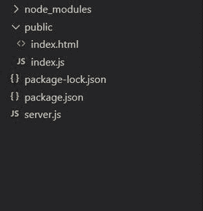
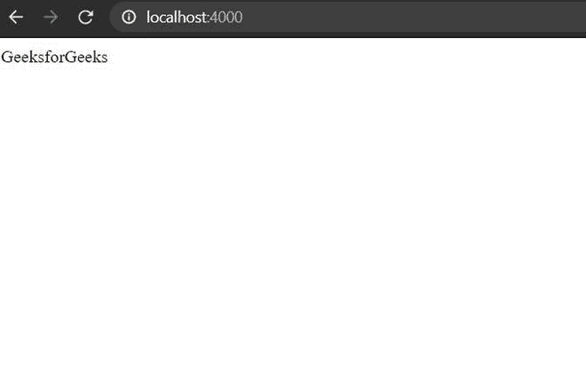

# 如何在使用 Socket 点击复选框时发出事件。IO？

> 原文:[https://www . geeksforgeeks . org/如何在使用套接字 io 点击复选框时发出事件/](https://www.geeksforgeeks.org/how-to-emit-an-event-when-a-checkbox-is-clicked-using-socket-io/)

**问题陈述:**任务是每当在前端单击特定复选框时，通过从后端发出事件来执行操作。这需要使用 Socket 来完成。输入输出和节点

**先决条件:**

1.  [**Node.js**](https://www.geeksforgeeks.org/nodejs-tutorials/) **:** 它是一个开源的 JavaScript 后端技术。
2.  [**Express.js**](https://www.geeksforgeeks.org/working-of-express-js-middleware-and-its-benefits/) **:是一个 node.js 服务器框架。**
3.  [**socket . io**](https://www.geeksforgeeks.org/introduction-to-sockets-io-in-node/)**:**它帮助我们在服务器和客户端之间创建基于事件的实时双向通信。

现在我们需要为我们的项目安装所需的包。

*   安装模块。

    ```
    npm install express socket.io
    ```

**项目结构:**



**步骤 1:** 创建一个名为 server.js 的服务器文件。

## server.js

```
// Importing express module
const express = require('express'); 
const app = express(); 

// Calling the public folder
app.use(express.static("public")); 

// Handling get request
app.get("/" , (req,res)=>{
  res.send("GeeksforGeeks); 
});

// Listing the server 
app.listen(4000 , ()=>{
    console.log("Server running on port 4000");
)
```

**输出:**现在，如果你打开本地主机即 localhost:4000 你会看到输出即——*geeks forgeeks*。



**步骤 2:** 现在，让我们将套接字实现到我们的服务器文件中，即 server.js

**语法:**

```
const io = require('socket.io')(server);
```

## server.js

```
// Importing express module
const express = require('express');
const app = express();
const server = require('http').Server(app);
const io = require('socket.io')(server);

// Calling the public folder
app.use(express.static('public'))

// Handling get request
app.get("/" , (req,res)=>{
    res.render("index");
});

// Listening to the server
server.listen(4000 , ()=>{
    console.log("server is running");
})
```