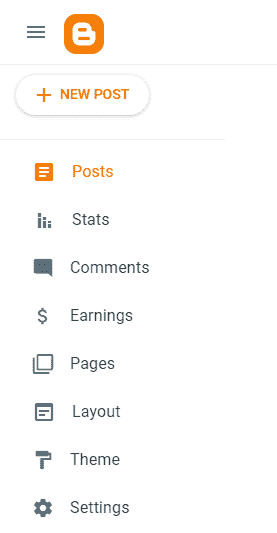
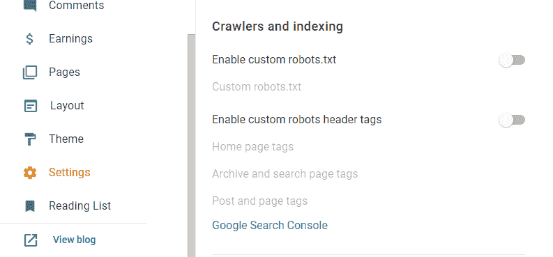
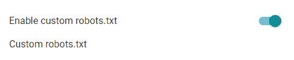
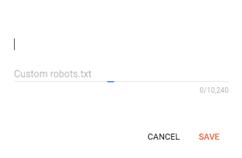
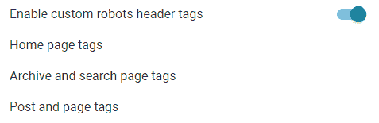
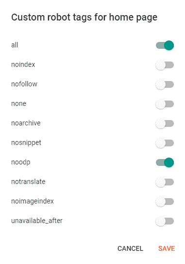
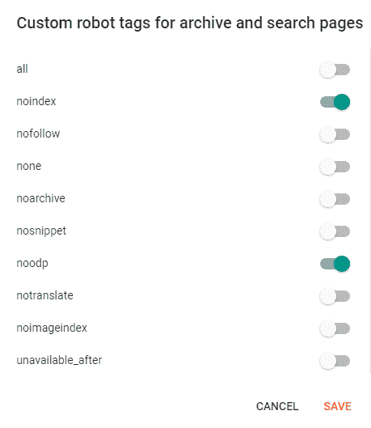
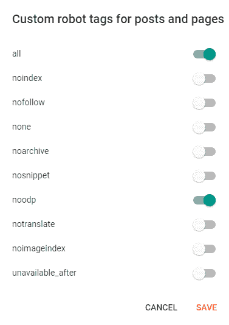

# 如何在 Blogger 中启用自定义 robots.txt 文件？

> 原文:[https://www . geesforgeks . org/如何启用自定义机器人-txt-file-in-blogger/](https://www.geeksforgeeks.org/how-to-enable-custom-robots-txt-file-in-blogger/)

robots.txt 是一个示例 txt 文件，我们在其中放置一小段代码，告诉搜索引擎爬虫在搜索引擎上抓取和索引您的网站页面。添加 robots.txt 将有助于网站处理哪些页面应该抓取和索引，以及哪些页面不应该抓取和索引。

按照步骤在 Blogger 中启用自定义 robots.txt。

**第一步:**用你的 Gmail 账号登录你的博主账号。

**第二步:**从左侧菜单点击“**设置”**



现在，导航到**爬虫和索引**部分。



**步骤 3:** 启用自定义机器人



启用切换按钮>>后，点击“**自定义机器人. txt”**

将这段简单的代码添加到**“定制机器人. txt”**中，点击**“保存”**

```html
User-agent: *
Allow: /
Sitemap: http://<subdomain_name>.<domain_name>.<tld>/sitemap.xml
```

**示例:**

```html
User-agent: *
Allow: /
Sitemap: http://www.example.com/sitemap.xml
```

**关于语法和添加更多高级功能，请参考以下链接:**

> https://developers.google.com/search/docs/advanced/robots/create-robots-txt



**步骤 4:** 启用自定义机器人标题标签



**第五步:**启用自定义机器人表头标签> >的切换按钮后，点击**【首页标签】> >** 启用**【全部】**和**【noodp】**切换并点击**【保存】**



**第六步:**然后，点击**“存档和搜索页面标签”> >** 启用**“noindex”****“noodp”**切换并点击**“保存”。**



然后，点击**“帖子和页面标签”** > >启用**“全部”**和**“noodp”**切换并点击**“保存”:**



**参考文献:**

*   [https://developers . Google . com/search/docs/advanced/robots/intro](https://developers.google.com/search/docs/advanced/robots/intro)
*   [https://developers . Google . com/search/docs/advanced/robots/create-robots-txt](https://developers.google.com/search/docs/advanced/robots/create-robots-txt)