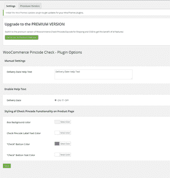
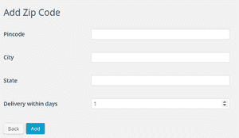
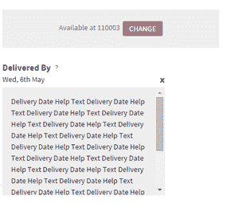

# 如何让客户知道你的 wordpress 网站是否按他们的密码交付？

> 原文:[https://www . geesforgeks . org/如何让客户知道你的 wordpress 网站是否按密码交付/](https://www.geeksforgeeks.org/how-to-enable-customers-to-know-if-your-wordpress-website-delivers-at-their-pincode-or-not/)

**woodcommerce check**Pincode**/zip code for shipping**plugin by**Phoenixx**对客户来说是一个很大的帮助，因为它使他们能够知道网站是否按照他们的 Pincode 以及大概的交付日期交付。它阻止用户从你没有送货的地区订购。从而提高客户满意率并降低购物车废弃率。

**第一步:**安装并激活插件。它出现在仪表板的左侧栏上。

**第二步:**进入插件的**设置**部分。它使您能够更改出现在您的网站上的密码检查器框的样式，并添加交付日期帮助文本(例如，“我们在上午 10 点至晚上 10 点之间交付”)。出现以下屏幕:

**步骤 3:****添加邮政编码**部分允许您添加任意多个邮政编码。您也可以查看邮政编码列表。您需要添加密码、城市、州以及产品在该密码下交付的天数。

**第四步:**网站上是这样的:

如果您想一次添加所有密码，请不要逐个添加每个密码；你可以通过**WBCOM design 使用 **Woo Pincode Checker** 。**它允许您上传使用此格式编写的 CSV 文件–

Pin 码:城市，州内交货天数:货到付款

(使用链接获取此模板:https://bit.ly/31790J5)。