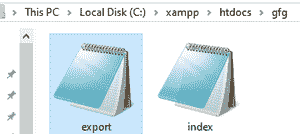
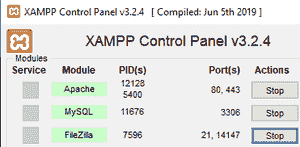
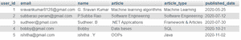
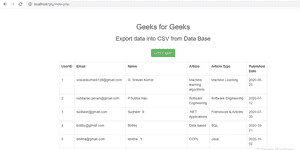
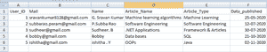

# 如何使用 XAMPP 从数据库导出数据到 CSV 文件？

> 原文:[https://www . geeksforgeeks . org/如何使用-xampp/](https://www.geeksforgeeks.org/how-to-export-data-to-csv-file-from-database-using-xampp/) 从数据库导出数据到 csv 文件

在本文中，我们将把数据库(MySQL)中的数据加载到 CSV 文件中。显示数据库中的数据，并将数据导出到 CSV 文件中。我们使用 XAMPP 工具在本地存储在数据库中。

**XAMPP** 代表跨平台、Apache、MySQL、PHP、Perl。它是用于网站开发的简单轻量级本地服务器之一。

**步骤:**

*   在 XAMPP 服务器(MySQL)数据库中创建数据库和表。
*   编写 PHP 脚本来访问这些数据
*   验证结果

**CSV 场景:**创建两个名为**index.php**和**export.php**的 PHP 脚本将这些文件放入**xampp/htdocs/文件夹/**



***index.php:*** 使用**MySQL _ fetch _ array 显示列和数据。**fetch _ array()/mysqli _ fetch _ array()函数将结果行作为关联数组、数值数组或两者提取。

**执行步骤:**

1.打开 XAMPP 服务器，启动 Apache 和 MySQL 服务器



2.创建名为“article_geeksdata”的数据库


3.在这个名为“geeksdata”的数据库中创建一个表并插入数据



打开记事本，键入以下代码。将此文件保存为**index.php**

## 服务器端编程语言（Professional Hypertext Preprocessor 的缩写）

```htmlhtml
<?php  

// Connect syntax
 $connect = mysqli_connect("localhost", 
    "root", "", "article_geeksdata");  

// Display data from geeksdata table
 $query ="SELECT * FROM geeksdata";  

// Storing it in result variable
 $result = mysqli_query($connect, $query);  
 ?>

// HTML code to display our data
// present in table
<!DOCTYPE html>
<html>

<head>
    <script src=
"https://ajax.googleapis.com/ajax/libs/jquery/3.1.0/jquery.min.js">
    </script>

    <link rel="stylesheet" href=
"https://maxcdn.bootstrapcdn.com/bootstrap/3.3.6/css/bootstrap.min.css" />

    <script src=
"https://maxcdn.bootstrapcdn.com/bootstrap/3.3.7/js/bootstrap.min.js">
    </script>
</head>

<body>
    <div class="container" style="width:900px;">
        <h2 align="center">Geeks for Geeks</h2>

        <h3 align="center">
            Export data into CSV from Data Base
        </h3>
        <br />

        <!-- After clicling on submit button 
            export.php code is revoked -->
        <form method="post" action="export.php" 
            align="center">
            <input type="submit" name="export" 
                value="CSV Export" 
                class="btn btn-success" />
        </form>
        <br />

        <!-- Code for table because our data is 
            displayed in tabular format -->
        <div class="table-responsive" id="employee_table">
            <table class="table table-bordered">
                <tr>
                    <th width="5%">UserID</th>

                    <th width="35%">Name</th>
                    <th width="10%">Article</th>
                    <th width="20%">Article Type</th>
                    <th width="5%">Published Date</th>
                </tr>
                <?php 

                // Fetching all data one by one using
                // while loop
                while($row = mysqli_fetch_array($result)) {  
                ?>

                <!-- taking attributes and storing 
                    in table cells -->
                <tr>
                    <!-- column names in table  -->
                    <td><?php echo $row["user_id"]; ?></td>
                    <td><?php echo $row["name"]; ?></td>
                    <td><?php echo $row["article"]; ?></td>
                    <td><?php echo $row["article_type"]; ?></td>
                    <td><?php echo $row["published_date"]; ?></td>
                </tr>
                <?php       
                }?>
            </table>
            <!-- Closing table tag  -->
        </div>
        <!-- Closing div tag -->
    </div>
</body>

</html>
```

**本网页输出**



现在在记事本中打开另一页，并键入以下代码。将此文件保存为**export.php**

## 服务器端编程语言（Professional Hypertext Preprocessor 的缩写）

```htmlhtml
<?php  

// Checking data by post method
if(isset($_POST["export"])) {  

    // Connect to our data base
    $connect = mysqli_connect("localhost", 
        "root", "", "article_geeksdata");  

    // Accept csv or text files
    header('Content-Type: text/csv; charset=utf-8');  

    // Download csv file as geeksdata.csv
    header('Content-Disposition: attachment; 
        filename=geeksdata.csv');  

    // Storing data 
    $output = fopen("php://output", "w");  

    // Placing data using fputcsv
    fputcsv($output, array('User_ID','Name', 
    'Article_Name', 'Article_Type', 'Data_published'));  

    // SQL query to fetch data from our table
    $query = "SELECT * from geeksdata";  

    // Result
    $result = mysqli_query($connect, $query);  

    while($row = mysqli_fetch_assoc($result)) {  

        // Fetching all rows of data one by one
        fputcsv($output, $row);  
    }

    // Closing tag
    fclose($output);  
}  
?>
```

**输出:**



**执行视频**

<video class="wp-video-shortcode" id="video-524955-1" width="640" height="360" preload="metadata" controls=""><source type="video/mp4" src="https://media.geeksforgeeks.org/wp-content/uploads/20201109174522/bandicam-2020-11-09-16-43-54-819.mp4?_=1">[https://media.geeksforgeeks.org/wp-content/uploads/20201109174522/bandicam-2020-11-09-16-43-54-819.mp4](https://media.geeksforgeeks.org/wp-content/uploads/20201109174522/bandicam-2020-11-09-16-43-54-819.mp4)</video>