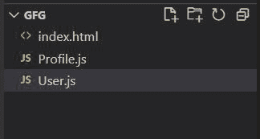
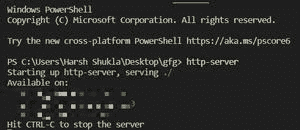
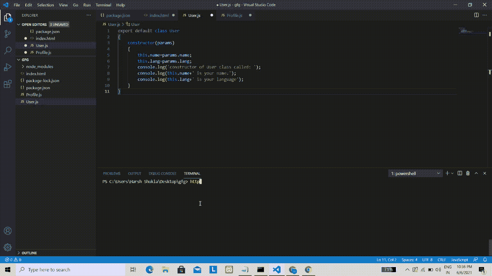

# 如何导出默认构造函数？

> 原文:[https://www . geesforgeks . org/如何导出-默认-构造函数/](https://www.geeksforgeeks.org/how-to-export-default-constructors/)

export 语句用于将一个 JavaScript 模块绑定到其他模块。为了导出默认构造函数，我们在需要的地方使用了一个 export 语句和 import 模块。创建类的实例时，会调用相应类的构造函数。

**语法:**

```html
export default class ClassName{...}
```

在下面的示例中，我们将通过导出和导入另一个模块来使用 JavaScript 模块。不过，仅支持 HTTPS 的跨来源请求。因此，我们需要在本地服务器上运行我们的 HTML 文件。

**进场:**

*   创建文件***index.html。**T3】*
*   创建一个 ***User.js*** 文件来导出模块。
*   创建另一个 ***Profile.js*** 文件来导入构造函数，并检查它是否在创建对象时被调用。
*   在 index.html 添加脚本-src(注意:因为我们正在导出模块，所以我们需要添加 type="module ")

**项目目录:**我们的项目目录会是这样的。



项目目录结构

**示例:**index.html 文件将包含导入模块的 *src* 到 Profile.js。Profile.js 文件将导入 *User.js* 并通过创建 User 类的对象来调用 *User.js* 的构造函数。User.js 文件将有一个构造函数，它接受参数并打印其值以及一些伪文本。

## index.html

```html
<!DOCTYPE html>

<head>
    <script type="module" 
        src="./Profile.js">
    </script>
</head>

<body>
    <div style="color: green; 
                font-size: 35px; 
                margin-left: 100px;">
        Geeks for Geeks
    </div>
    <p style="color: rgb(44, 46, 44); 
                font-size: 20px; 
                margin-left: 100px;">
        Result will be displayed at console
    </p>
</body>

</html>
```

## Profile.js

```html
// Importing User
import User from './User.js';

// Creating new user object
var user = new User({name:'Lorem Ipsum',lang:'Javascript'});

// Printing data
console.log(user);
```

## User.js

```html
export default class User
{
    constructor(params)
    {
        this.name=params.name;
        this.lang=params.lang;
        console.log('constructor of User class called: ');
        console.log(this.name+' is your name.');
        console.log(this.lang+' is your language');
    }
}
```

**在本地服务器上运行 HTML 文件的步骤**

*   如果你的机器上安装了 NodeJs 和 npm，通过在终端上运行这个命令来安装 ***http-server*** 。

    ```html
    npm install http-server -g
    ```

*   通过终端导航到保存所有文件的目录，然后键入。

    ```html
    http-server
    ```

**输出:**

*   您将看到如下所示的本地服务器列表:
    

    服务的可用端口列表

*   现在点击任何可用的本地服务器，我们将看到以下输出。
    