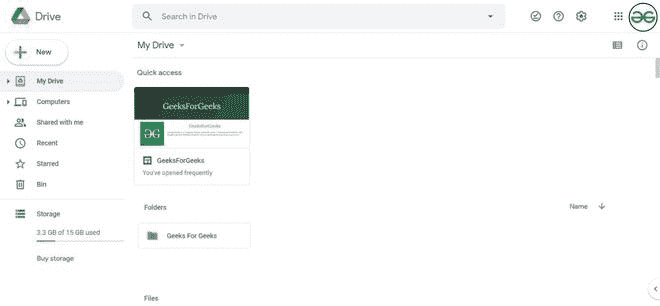
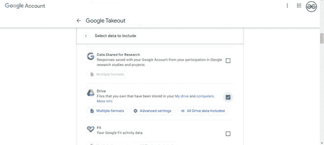
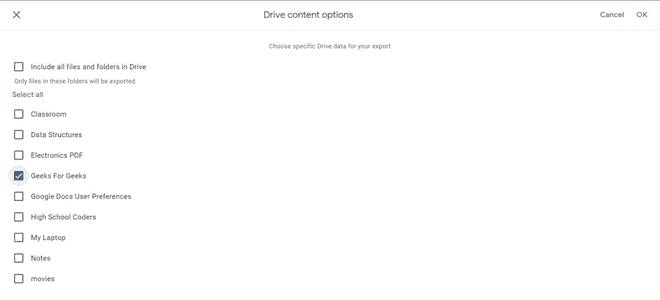
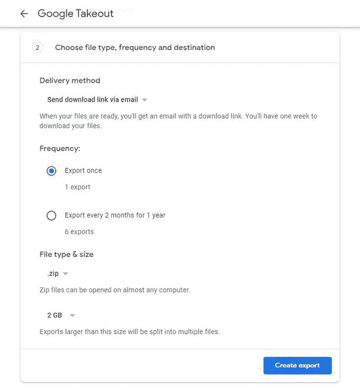
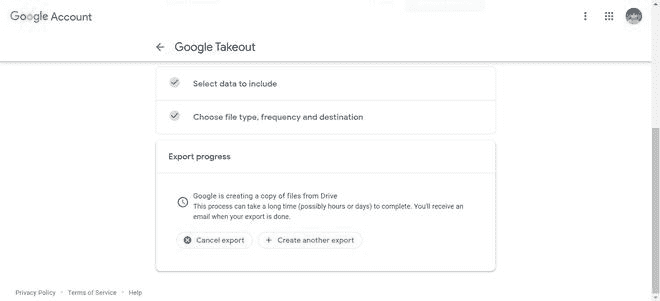
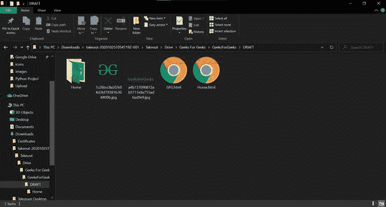

# 如何在新谷歌网站中导出带有谷歌外卖的网站？

> 原文:[https://www . geeksforgeeks . org/如何通过谷歌网站导出新谷歌网站外卖/](https://www.geeksforgeeks.org/how-to-export-sites-with-google-takeout-in-new-google-sites/)

有时为了避免意外，你想备份你的网站，你可以在谷歌网站。谷歌有一个外卖设施，可以让你拥有任何谷歌产品中存储或保存的任何信息的离线版本，从日历到硬盘，它涵盖了一切。

**网站:**[https://takeout.google.com/](https://takeout.google.com/)

要获取站点的离线版本，请按照下面提到的步骤操作:

*   转到您的驱动器帐户，创建一个文件夹，并在该文件夹中移动或创建站点。

*   之后去[外卖](https://takeout.google.com/)你会看到各种谷歌产品取消选择，选择只带外卖的驱动选项。

*   现在，让我们过滤驱动器数据并选择我们想要的唯一文件夹。为此，请转至“**包含的所有驱动器数据**”选项。选择您保存站点的文件夹，然后点击确定。

*   点击下一步，填写其他重要细节，如交付方式、频率和文件类型和大小。然后点击创建导出。

*   之后，谷歌外卖将通过您选择的选项通知您，当您的导出准备就绪时，您可以获得您创建的网站的下载版本。

当文件准备好的时候，你可以下载文件，这样你就会有一个离线版本的网站。

> **注:**
> 
> 1.  外卖只允许你从文件夹中选择，所以你必须先把你的文件保存在一个文件夹中。
> 2.  如果网站是共享的，你不能获得网站的离线版本，网站必须是你自己的。