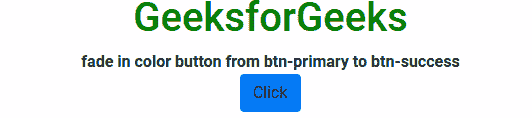

# 如何从 btn-primary 到 btn-success 淡入彩色按钮？

> 原文:[https://www . geesforgeks . org/how-淡入色-button-from-BTN-primary-BTN-success/](https://www.geeksforgeeks.org/how-to-fade-in-color-button-from-btn-primary-to-btn-success/)

问题是按钮的颜色从**BTN-小学类**渐变为 **btn-success** 。这需要我们添加转场以及添加 **btn-success** 类。

**进场:**

*   首先，在**@关键帧**的帮助下添加一个过渡，使用以下语法将背景颜色从**蓝色**慢慢更改为**绿色**BTN-success 类:

    ```
    @keyframes animation-name {keyframes-selector {css-styles;}}
    ```

*   其次，我们必须使用

    ```
    // To target the elements having class change
    $(".change")                      
    // To add click event to elements having class change
    $(".change").click(function(){}) 

    ```

    将类更改为添加点击事件
*   最后，要更改添加和删除类，我们分别使用以下方法**button . addclass(“BTN-success”)**、**button . remove class(“BTN-primary”)**。

以下示例说明了该方法:
**示例:**

```
<!DOCTYPE html>
<html lang="en" dir="ltr">
    <head>
        <meta charset="utf-8" />
        <link rel="stylesheet" href=
"https://stackpath.bootstrapcdn.com/bootstrap/4.4.1/css/bootstrap.min.css" 
integrity="sha384-Vkoo8x4CGsO3+Hhxv8T/Q5PaXtkKtu6ug5TOeNV6gBiFeWPGFN9MuhOf23Q9Ifjh" 
crossorigin="anonymous" />
        <script src=
"https://code.jquery.com/jquery-3.4.1.slim.min.js" 
integrity="sha384-J6qa4849blE2+poT4WnyKhv5vZF5SrPo0iEjwBvKU7imGFAV0wwj1yYfoRSJoZ+n"
crossorigin="anonymous">
        </script>
        <script src=
"https://cdn.jsdelivr.net/npm/popper.js@1.16.0/dist/umd/popper.min.js"
integrity="sha384-Q6E9RHvbIyZFJoft+2mJbHaEWldlvI9IOYy5n3zV9zzTtmI3UksdQRVvoxMfooAo" 
crossorigin="anonymous">
        </script>
        <script src=
"https://stackpath.bootstrapcdn.com/bootstrap/4.4.1/js/bootstrap.min.js"
integrity="sha384-wfSDF2E50Y2D1uUdj0O3uMBJnjuUD4Ih7YwaYd1iqfktj0Uod8GCExl3Og8ifwB6"
crossorigin="anonymous">
        </script>
        <style>
            body {
                text-align: center;
            }
            .btn.btn-success {
                transition-duration: 2s;
                animation-name: colorTransition;
            }

            @keyframes colorTransition {
                from {
                    background-color: #007bff;
                }
                to {
                    background-color: #32cd32;
                }
            }

            h1 {
                color: green;
            }
        </style>
    </head>
    <body>
        <h1>GeeksforGeeks</h1>
        <b>
             fade in color button from
             btn-primary to btn-success
        </b>
        <div class="cb">
            <a class="btn btn-primary change">Click</a>
        </div>
        <script type="text/javascript">
            $(".change").click(function (e) {
                var button = $(".change");
                button.addClass("btn-success");
                button.removeClass("btn-primary");
            });
        </script>
    </body>
</html>
```

**输出:**
