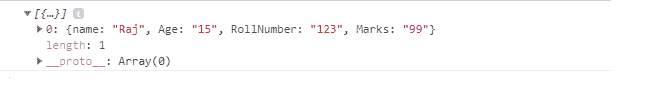
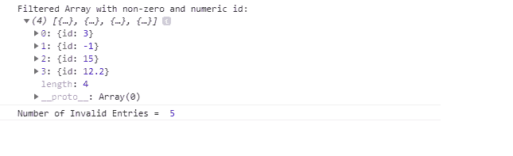

# 如何基于属性过滤对象数组？

> 原文:[https://www . geesforgeks . org/如何基于属性过滤对象数组/](https://www.geeksforgeeks.org/how-to-filter-object-array-based-on-attributes/)

可以使用 JavaScript 中的 **[filter()](https://www.geeksforgeeks.org/javascript-array-filter-method/)** 函数根据属性过滤对象数组。**过滤器()**函数将返回一个新数组，该数组包含通过给定条件的所有数组元素。如果没有元素通过该条件，它将返回一个空数组。 **filter()** 函数循环或迭代每个数组元素，并将每个元素传递给回调函数。

**语法:**

```html
var newArray = array.filter(function(item)
 {
  return conditional_statement;
 });

```

**注意:****滤镜()**功能不改变原阵列。

**示例 1:** 我们创建一个“学生”数组，并调用数组上的**过滤器()**函数，从数组中导出满足给定条件的元素。

## java 描述语言

```html
<script>
var obj = {
    'Students': [{
            "name": "Raj",
             "Age":"15",
            "RollNumber": "123",
            "Marks": "99",

        }, {
            "name": "Aman",
             "Age":"14",
            "RollNumber": "223",
            "Marks": "69",
           },
           {
            "name": "Vivek",
             "Age":"13",
            "RollNumber": "253",
            "Marks": "89",
           },
        ]
};

var newArray = obj.Students.filter(function (el)
{
  return el.Age >=15 &&
         el.RollNumber <= 200 &&
         el.Marks >= 80 ;
}
);
console.log(newArray);
</script>
```

**输出:**在数组上应用过滤函数后，只要数组的第一个元素满足给定的条件，我们就会得到它作为输出。



**示例 2:** 以下示例显示了从数组中过滤无效条目。我们创建一个“id”的数组，并调用数组上的**过滤器()**函数来导出值为非零数字的“id”。

## java 描述语言

```html
<script>
let array = [
  { id: 3 },
  { id: -1 },
  { id: 0 },
  { id: 15 },
  { id: 12.2 },
  { },
  { id: null },
  { id: NaN },
  { id: 'undefined' }
]

let countInvalidEntries = 0

function filterById(obj) {
  if (Number.isFinite(obj.id) && obj.id !== 0) 
  {
    return true
  } 
  countInvalidEntries++
  return false;
}

let arrayById = array.filter(filterById);

console.log('Filtered Array with non-zero and numeric id: \n',
        arrayById);

console.log('Number of Invalid Entries = ', countInvalidEntries);

</script>
```

**输出:**在大小为 9 的数组上应用**过滤器()**函数后，我们得到 4 个有效的(非零数字) *id* 和 5 个无效的 *id*

